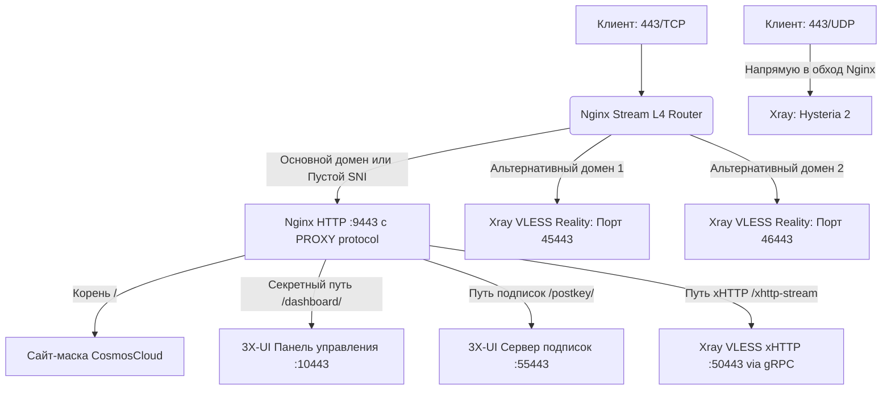

# 🛡️ Hardened VPS & Nginx L4 Stream Router Mask for 3X-UI (v1.3.1-xHTTP)

Автоматизированное комплексное решение для развертывания отказоустойчивой и скрытой инфраструктуры обхода блокировок. Проект ориентирован на ОС **Ubuntu 24.04 LTS**, использует официальную сборку **Nginx (Stream L4 Router)** и панель управления **3X-UI**. Система оптимизирована для обеспечения максимальной пропускной способности и защищена от активного сетевого сканирования (Active Probing) со стороны систем DPI.

---

## 🌟 Ключевые особенности и архитектура безопасности

Развертывание разделено на несколько изолированных уровней оптимизации и защиты, параметры которых гибко настраиваются в интерактивном режиме:

### 1. Уровень ОС, сетевого стека и базовой безопасности
* **Тюнинг сетевого стека (Proxy Tuning):** Независимо от выбранных конфигураций, скрипт на начальном этапе оптимизирует параметры ядра через `sysctl`. Для предотвращения потерь пакетов при пиковых нагрузках увеличиваются лимиты сетевых очередей (`somaxconn`, `backlog`), расширяются TCP-буферы (`rmem`, `wmem`), а также деактивируется механизм TCP Slow Start после простоя.
* **Обновление пакетной базы:** Скрипт подключает репозиторий `universe` и обновляет списки пакетов ОС для предотвращения конфликтов зависимостей, избегая при этом принудительного выполнения `apt upgrade`, способного нарушить работу сторонних служб.
* **Системный мониторинг:** Доступна опциональная установка пакета диагностических утилит для мониторинга ресурсов и сетевой активности в режиме реального времени (`htop`, `btop`, `iperf3`, `iftop`, `tcpdump`, `mtr-tiny`, `jq`, `tmux`, `ncdu`, `vnstat` и др.).
* **Интеграция TCP BBR и изоляция IPv6 (опционально):** 
  * Активация алгоритма контроля перегрузок TCP BBR и дисциплины очередей FQ для минимизации задержек и стабилизации пропускной способности.
  * Полное отключение IPv6 на уровне ядра и брандмауэра UFW для предотвращения утечек DNS-запросов и защиты от сканирования подсети IPv6.
* **Строгая конфигурация брандмауэра (UFW):** По умолчанию блокируются все входящие соединения. Доступ открывается только к строго необходимым портам:
  * Измененный (кастомный) порт SSH.
  * **TCP:** `80`, `443`, `8443`.
  * **UDP:** `443`, `8443`.
  * Реализована возможность полной блокировки входящих ICMP (Ping) запросов для скрытия хоста от автоматических сканеров.
* **Защита от перебора паролей (Fail2ban):** Автоматическая интеграция Fail2ban для защиты SSH-порта на основе анализа системного журнала `systemd` с последующим блокированием атакующих IP-адресов.

### Уровень контроля доступа и укрепления SSH (Hardening)
* **Управление учетными записями:** Опциональное создание непривилегированного пользователя с обязательной валидацией пароля на сложность (длина от 12 символов, использование спецсимволов и разного регистра), а также безопасная беспарольная настройка `sudo` с проверкой синтаксиса через `visudo`.
* **Адаптация под Ubuntu 24.04:** Автоматический перевод службы SSH с механизма Socket Activation на классическую модель `ssh.service` для гарантирования стабильной работы кастомного порта.
* **Интеграция SSH-ключей:** Генерация новой ключевой пары Ed25519 непосредственно на сервере либо импорт существующего публичного ключа пользователя.
* **Укрепление конфигурации SSH (Hardening):** Опциональное отключение аутентификации по паролю. Опция становится доступной только после успешного импорта SSH-ключей на предыдущем этапе, что исключает риск случайной потери доступа. Перед применением конфигурация проверяется утилитой `sshd -t`.

### Развертывание панели 3X-UI
* **Гибкая установка:** Возможность развернуть панель `3x-ui` с выбором версии (стабильная latest или конкретный релиз, например - `v2.9.4`). 
  > **Важно:** Для использовании L4-маршрутизатора панель должна работать без собственных SSL-сертификатов. При установке панели выберите работу через localhost (в конце установки выбрать опцию 4 и 'N' - отказ от автоматических сертификатов).

### 2. Уровень маршрутизации трафика (Nginx L4 Stream)
* **Мультиплексирование на порту TCP 443 (резервный — 8443):** Модуль Nginx Stream анализирует SNI-заголовки запросов (технология `ssl_preread`) без детерминирования (расшифровки) TLS-сессии:
  * Запросы к **основному домену** перенаправляются на локальный веб-сервер для отображения сайта-маскировки.
  * Запросы к **секретному пути панели** проксируются на внутренний веб-интерфейс 3X-UI.
  * Запросы к **пути подписок (`/postkey/`)** проксируются на выделенный внутренний порт подписок.
  * Запросы к **альтернативным доменам** прозрачно маршрутизируются на порты инбаундов VLESS Reality.
* **Высокопроизводительный шлюз xHTTP (h2c/gRPC):** Запросы, содержащие секретный путь xHTTP (например, `/xhttp-stream`), маршрутизируются через проксирующий шлюз `grpc_pass` на локальный порт Xray [1.1.2]. Проксирование незашифрованного HTTP/2 (h2c) внутри локальной петли сервера исключает оверхед двойного шифрования (TLS-in-TLS), а отключение буферизации данных обеспечивает передачу пакетов в режиме реального времени с минимальным пингом.
* **Локальный HTTPS-бэкенд (Порт 9443/TCP):** Внутренний порт Nginx, обрабатывающий расшифрованный HTTPS-трафик для сайта-маскировки. Принимает соединения исключительно на локальном интерфейсе (`127.0.0.1`) с поддержкой PROXY-протокола. Это позволяет сохранять реальные IP-адреса клиентов в веб-логах, корректно обрабатывать запросы к панели и подпискам, а также выступать конечной точкой (Target) для инбаундов VLESS Reality.
* **Прямая маршрутизация UDP (443/8443 UDP):** Трафик протоколов Hysteria 2 / TUIC на портах `443/UDP` и `8443/UDP` связывается напрямую с ядром Xray, минуя Nginx, для обеспечения максимальной производительности.
* **Автоматизация SSL Let's Encrypt:** Официальный клиент Certbot выпускает основной сертификат (для сайта-маскировки и домена панели) и альтернативные сертификаты (для SNI-инбаундов). Реализован `deploy-hook` для бесшовной перезагрузки Nginx при автоматическом продлении сертификатов.
* **Продвинутый сайт-маска (CosmosCloud):** Шаблон маскировки имитирует интерфейс авторизации и API-заглушки приватного облака CosmosCloud с передачей специфических HTTP-заголовков (например, `X-Cosmoscloud-Version`).

---

## 📊 Схема движения трафика



---

## 🚀 Быстрый запуск (Два шага)

### Шаг 1: Подготовка сервера и установка 3X-UI
Запустите скрипт обновления системы, установки утилит и базовой настройки безопасности ОС на чистом сервере:
```bash
wget https://raw.githubusercontent.com/Itman75/Nginx-L4-Stream-Router-Mask-for-3x-ui/main/secure-vps.sh
chmod +x secure-vps.sh
./secure-vps.sh
```
> **Результат выполнения:** Опциональное обновление ОС, установка утилит администрирования, активация BBR, отключение IPv6, создание безопасного sudo-пользователя, импорт или генерация SSH-ключей Ed25519, изменение порта SSH, отключение парольного входа, базовая настройка UFW, Fail2ban и установка панели 3X-UI (без локальных SSL-сертификатов, с проксированием через localhost).

### Шаг 2: Установка L4-роутера и настройка маскировки
Запустите интерактивный скрипт маршрутизации трафика:
```bash
wget https://raw.githubusercontent.com/Itman75/Nginx-L4-Stream-Router-Mask-for-3x-ui/main/setup_mask.sh
chmod +x setup_mask.sh
./setup_mask.sh
```
> **Результат выполнения:** Подключение официального репозитория Nginx, установка Certbot, выпуск сертификатов Let's Encrypt для привязанных доменов, развертывание сайта-маскировки CosmosCloud, конфигурация Stream и HTTP серверов Nginx с интеграцией PROXY-протокола.

---

## 🛠 Обязательная настройка после установки

> [!IMPORTANT]
> **ПРАВИЛО РАСПРЕДЕЛЕНИЯ СЕРТИФИКАТОВ:**
> Внутри панели 3X-UI **пути к файлам SSL-сертификатов везде должны оставаться пустыми** (включая инбаунд xHTTP, подписки и панель). Внешнее TLS-шифрование полностью обеспечивается на стороне Nginx [1.1.2].
> **Исключение:** Инбаунд Hysteria 2 (UDP). Поскольку этот трафик обрабатывается в обход Nginx, в его настройках необходимо явно указать пути к `.pem` файлам сертификатов.

---

### 1. Настройка инбаундов VLESS REALITY

Для каждого альтернативного домена создайте отдельное подключение в панели:

* **Порт (Port):** Локальный порт, назначенный скриптом на Шаге 2 (например, `45443`).
* **IP для прослушивания (Listen IP):** `127.0.0.1` (скрывает порт Reality от внешнего сканирования).
* **Поток (Stream) -> Транспорт:** `TCP` (или `RAW`).
* **Proxy Protocol:** Включен (`true`). 
* **Безопасность (Security):** `Reality`.
* **Xver (Proxy Protocol к декою):** `1` (PROXY protocol v1).
* **Цель (Dest):** `127.0.0.1:9443`.

#### Шаблон конфигурации inbound VLESS Reality (JSON):
```json
{
  "listen": "127.0.0.1",
  "port": 45443,
  "protocol": "vless",
  "tag": "in-45443-tcp",
  "settings": {
    "clients": [
      {
        "id": "ваш-uuid-клиента",
        "flow": "xtls-rprx-vision"
      }
    ],
    "decryption": "none"
  },
  "streamSettings": {
    "network": "tcp",
    "tcpSettings": {
      "acceptProxyProtocol": true,
      "header": {
        "type": "none"
      }
    },
    "security": "reality",
    "realitySettings": {
      "show": false,
      "xver": 1,
      "target": "127.0.0.1:9443",
      "serverNames": [
        "your.realityalt.domain"
      ],
      "privateKey": "blablabla",
      "minClientVer": "",
      "maxClientVer": "",
      "maxTimediff": 0,
      "shortIds": [
        "blablabla"
      ],
      "settings": {
        "publicKey": "blablabla",
        "fingerprint": "chrome",
        "spiderX": "/"
      }
    },
    "externalProxy": [
      {
        "forceTls": "same",
        "dest": "your.realityalt.domain",
        "port": 443
      }
    ]
  }
}
```

---

### 2. Настройка инбаунда Hysteria 2 (UDP)

* **Порт (Port):** `443` (или `8443`).
* **Протокол (Protocol):** `udp`.
* **IP для прослушивания (Listen IP):** `0.0.0.0`.
* **Безопасность (Security):** `TLS` (шифрование обязательно, так как трафик идет в обход Nginx).
* **Сертификаты (TLS):** Полные пути к файлам Let's Encrypt, выпущенным Certbot на Шаге 2.

#### Шаблон конфигурации инбаунда Hysteria 2 (JSON):
```json
{
  "listen": "0.0.0.0",
  "port": 443,
  "protocol": "hysteria",
  "tag": "in-443-udp",
  "settings": {
    "clients": [
      {
        "id": "клиент-пароль"
      }
    ],
    "version": 2
  },
  "sniffing": {
    "enabled": false
  },
  "streamSettings": {
    "network": "hysteria",
    "hysteriaSettings": {
      "version": 2,
      "udpIdleTimeout": 60,
      "masquerade": {
        "type": "proxy",
        "dir": "",
        "url": "http://127.0.0.1:80",
        "rewriteHost": false,
        "insecure": false,
        "content": "",
        "headers": {},
        "statusCode": 0
      }
    },
     "security": "tls",
    "tlsSettings": {
      "serverName": "your.primary.domain",
      "minVersion": "1.3",
      "maxVersion": "1.3",
      "certificates": [
        {
          "certificateFile": "/etc/letsencrypt/live/your.primary.domain/fullchain.pem",
          "keyFile": "/etc/letsencrypt/live/your.primary.domain/privkey.pem",
          "useFile": true
        }
      ],
      "alpn": [
        "h3"
      ]
    }
  }
}
```

---

### 3. Настройка системы подписок (Subscriptions)

Для организации безопасного и маскированного обновления клиентских конфигураций выполните следующие действия:

1. Перейдите в **Настройки панели** -> вкладка **Настройки подписок**.
2. В поле **URI обратного прокси (Subscription URL template)** укажите основной домен без порта (Nginx перенаправит трафик с порта 443):
   ```text
   https://your.primary.domain/postkey/
   ```
3. Убедитесь, что **URI-путь подписки (Subscription path)** имеет значение: `/postkey/`.
4. **Порт подписки (Subscription port):** Укажите порт подписок, заданный на Шаге 2 (по умолчанию `55443`). Порт будет открыт локально (`127.0.0.1`) для проксирования трафика из Nginx.
5. Пути к SSL-сертификатам в настройках подписок оставьте **пустыми**.
6. Нажмите **Сохранить настройки** и выполните команду **Перезапустить панель**.

---

### 4. Настройка инбаунда VLESS xHTTP (TCP)

Для организации подключения по устойчивому к блокировкам транспорту xHTTP (SplitHTTP) выполните следующие действия:

1. Создайте подключение типа **`vless`** со следующими параметрами:
   * **Порт (Port):** Внутренний порт xHTTP, заданный на Шаге 2 (по умолчанию `50443`).
   * **IP для прослушивания (Listen IP):** `127.0.0.1` (изолирует порт внутри сервера).
   * **Сеть (Network):** Выберите **`xhttp`**.
2. В расширенных параметрах транспорта задайте настройки:
   * **Путь (Path):** Секретный путь xHTTP, заданный на Шаге 2 (по умолчанию `/xhttp-stream`).
   * **Хост (Host):** Ваш основной домен (например, `your.primary.domain`).
   * **Режим (Mode):** Строго **`stream-one`** *(Обязательный параметр для корректной gRPC h2c-интеграции со шлюзом Nginx)*.
   * **Padding Bytes:** Диапазон рандомизации пакетов, например `100-1000`.
   * **Padding Obfs Mode:** Включен (`true`).
3. **Безопасность (Security):** Установите значение **`none`** *(так как TLS-терминация трафика полностью обеспечивается веб-сервером Nginx на порту 443)*.
4. **Accept Proxy Protocol:** Выключен (`false`).
5. Рекомендуется активировать **Сниффинг (Sniffing)** для протоколов `http` и `tls` во вкладке сопутствующих параметров для корректной маршрутизации запросов.

#### Шаблон конфигурации inbound VLESS xHTTP (JSON):
```json
{
  "listen": "127.0.0.1",
  "port": 50443,
  "protocol": "vless",
  "tag": "in-50443-tcp",
  "settings": {
    "clients": [
      {
        "id": "ваш-uuid-клиента"
      }
    ],
    "decryption": "none"
  },
  "sniffing": {
    "enabled": true,
    "destOverride": [
      "http",
      "tls",
      "quic"
    ],
    "metadataOnly": false
  },
  "streamSettings": {
    "network": "xhttp",
    "xhttpSettings": {
      "path": "/xhttp-stream",
      "host": "your.primary.domain",
      "mode": "stream-one",
      "xPaddingBytes": "100-1000",
      "xPaddingObfsMode": true,
      "xPaddingKey": "",
      "xPaddingHeader": "",
      "xPaddingPlacement": "",
      "xPaddingMethod": "",
      "sessionIDPlacement": "",
      "sessionIDKey": "",
      "sessionIDTable": "",
      "sessionIDLength": "",
      "seqPlacement": "",
      "seqKey": "",
      "uplinkDataPlacement": "",
      "uplinkDataKey": "",
      "scMaxEachPostBytes": "",
      "noSSEHeader": false,
      "scMaxBufferedPosts": 30,
      "scStreamUpServerSecs": "20-80",
      "serverMaxHeaderBytes": 0,
      "uplinkHTTPMethod": "",
      "headers": {},
      "scMinPostsIntervalMs": "",
      "uplinkChunkSize": 0,
      "noGRPCHeader": false,
      "enableXmux": false
    },
    "security": "none"
  }
}
```

---

## 🔒 Примерная таблица портов и правил фильтрации (UFW) (Порты могут выбираться Вами при развёртывании)

После развертывания брандмауэр UFW разграничивает доступ к ресурсам по следующей схеме:

| Порт / Протокол | Направление | Внешний доступ (WAN) | Назначение |
| :--- | :--- | :--- | :--- |
| `[Ваш порт SSH]/TCP` | Входящий | **Разрешен** | Администрирование сервера |
| `80/TCP` | Входящий | **Разрешен** | Для выпуска/продления сертификатов Let's Encrypt |
| `443/TCP` | Входящий | **Разрешен** | Единая точка входа Nginx Stream (Сайт, Панель, Подписки, xHTTP, VLESS) |
| `443/UDP` | Входящий | **Разрешен** | Прямой доступ к Xray (Hysteria 2) |
| `8443/TCP` | Входящий | **Разрешен** | Резервная точка входа Nginx Stream |
| `8443/UDP` | Входящий | **Разрешен** | Прямой доступ к Xray (Hysteria 2 - Резервный) |
| `9443/TCP` | Локальный | **Заблокирован** | Локальный HTTPS-бэкенд Nginx (сайт-маска, обработка PROXY protocol) |
| `10443/TCP` | Локальный | **Заблокирован** | Внутренний веб-интерфейс 3X-UI |
| `50443/TCP` | Локальный | **Заблокирован** | Локальный шлюз VLESS xHTTP (доступ только через домен Nginx) |
| `55443/TCP` | Локальный | **Заблокирован** | Локальный сервер подписок 3X-UI |
| `45443/TCP` | Локальный | **Заблокирован** | Reality Backend 1 (доступ только по SNI через порт 443) |
| `46443/TCP` | Локальный | **Заблокирован** | Reality Backend 2 (доступ только по SNI через порт 443) |

---

*Программное обеспечение предоставляется по принципу «как есть» (As Is) исключительно в ознакомительных и образовательных целях для демонстрации принципов разграничения сетевого трафика на транспортном и прикладном уровнях модели OSI.*
