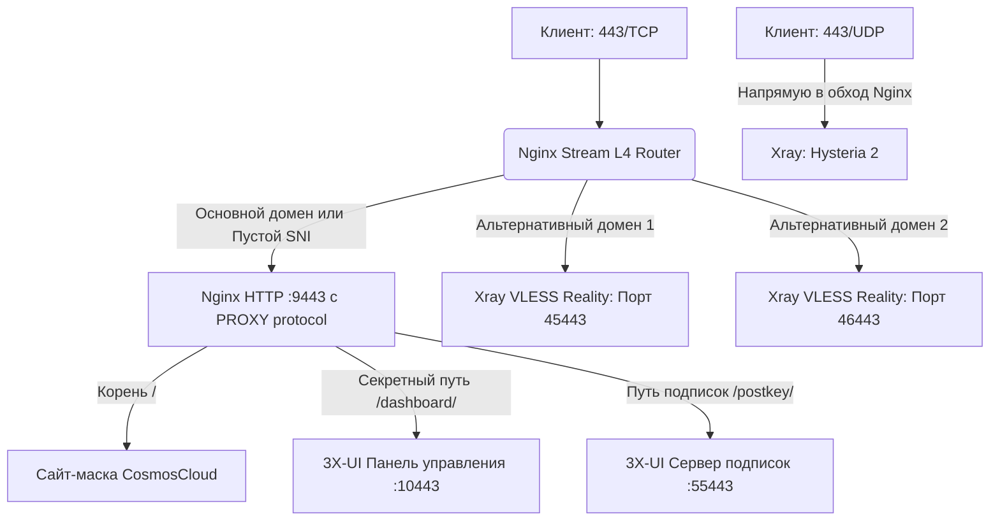

# 🛡️ Hardened VPS & Nginx L4 Stream Router Mask for 3X-UI (v1.0.9-Clean)

Автоматизированное комплексное решение для развертывания отказоустойчивой, скрытой и высокопроизводительной инфраструктуры обхода блокировок на базе ядра **Ubuntu 24.04 LTS**, официальной сборки **Nginx (Stream L4 Router)** и панели управления **3X-UI**, настроено на максимальное быстродействие и защищено от активного сетевого сканирования (Active Probing) со стороны систем DPI.

---

## 🌟 Ключевые особенности и архитектура безопасности

Развертывание разделено на два изолированных уровня защиты:

### 1. Уровень ОС и Сетевого Стека (Ядро, Брандмауэр и Утилиты)
* **Автоматическое обновление и очистка:** Перед началом работы скрипт производит полное обновление пакетной базы ОС до стабильных версий (`apt update && apt upgrade`), а также очистку от неиспользуемых зависимостей.
* **Расширенный системный мониторинг:** Устанавливается мощный диагностический набор инструментов для отслеживания сети и ресурсов в реальном времени (`htop`, `btop`, `iperf3`, `iftop`, `tcpdump`, `mtr-tiny`, `net-tools` и др.).
* **Ядро с оптимизацией BBR:** Автоматическое включение контроля перегрузки TCP BBR и очереди FQ на уровне ядра для снижения задержек и стабилизации скорости при потерях пакетов.
* **Изоляция IPv6:** Полное отключение IPv6 на уровне операционной системы и брандмауэра для устранения векторов утечки DNS.
* **Строгий IPv4 Firewall (UFW):** Блокировка всех входящих соединений по умолчанию. Открытыми остаются только публичные порты `80/TCP`, `443/TCP/UDP` и `8443/TCP/UDP`. Служебные порты панели, подписок и Reality полностью скрыты от внешнего сканирования.
* **Fail2ban Интеграция:** Автоматическая защита SSH-порта от brute-force атак с баном на уровне системного лога systemd.

### 2. Уровень Маршрутизации Трафика (Nginx L4 Stream) [1]
* **Мультиплексирование на одном порту (443/8443 TCP):** Nginx Stream считывает SNI-заголовки запросов (технология `ssl_preread`) без дешифрации трафика:
  * Запросы к **основному домену** уходят на локальный веб-сервер Nginx для отображения сайта-маскировки [1].
  * Запросы к **секретному пути панели** проксируются на внутренний веб-интерфейс 3X-UI.
  * Запросы к **пути подписок (`/postkey/`)** проксируются на выделенный порт подписок.
  * Запросы к **альтернативным доменам** прозрачно перенаправляются на локальные порты VLESS Reality.
* **Прямой обход для UDP (443/8443 UDP):** Трафик протоколов Hysteria 2 / TUIC на портах `443/UDP` и `8443/UDP` биндится напрямую в Xray, минуя Nginx, что гарантирует максимальную пропускную способность.
* **Автоматизация SSL Let's Encrypt:** Официальный Certbot выпускает сертификат сертификаты для самой панели(Primary) и для SNI инбаундов (Alternative, каждый домен привязывается к определяемому вами порту при развёртывании). Реализован deploy-hook для мгновенной перезагрузки Nginx при автопродлении сертификата.
* **Продвинутый Decoy (CosmosCloud):** Шаблон маскировки имитирует интерфейс авторизации и API-заглушки приватного облака CosmosCloud с передачей специфических HTTP-заголовков (`X-Cosmoscloud-Version`).

---

## 📊 Схема движения трафика



---

## 🚀 Быстрый запуск (Два шага)

### Шаг 1: Подготовка сервера, обновление и установка 3X-UI
Запустите скрипт обновления системы, установки утилит и hardening-настройки ОС на чистом сервере:
```bash
wget https://raw.githubusercontent.com/Itman75/Nginx-L4-Stream-Router-Mask-for-3x-ui/main/secure-vps.sh
chmod +x secure-vps.sh
./secure-vps.sh
```
> **Что будет сделано:** Полное обновление ОС (`apt update && apt upgrade`), установка утилит администрирования (`htop`, `btop`, `iperf3`, `tcpdump`...), включение BBR, отключение IPv6, создание безопасного sudo-пользователя, импорт или генерация SSH-ключей Ed25519, изменение порта SSH, отключение парольного входа по SSH, настройка UFW, установка Fail2ban и развертывание чистой панели 3X-UI

### Шаг 2: Установка L4-роутера и маскировки Nginx
Запустите интерактивный скрипт маршрутизации:
```bash
wget https://raw.githubusercontent.com/Itman75/Nginx-L4-Stream-Router-Mask-for-3x-ui/main/setup_mask.sh
chmod +x setup_mask.sh
./setup_mask.sh
```
> **Что будет сделано:** Подключение официального репозитория Nginx, установка Certbot, выпуск SAN-сертификата Let's Encrypt для всех доменов, генерация веб-интерфейса CosmosCloud, настройка конфигурации Stream и HTTP серверов Nginx с интеграцией PROXY-протокола.

---

## 🛠 Обязательная настройка после работы скриптов

> [!IMPORTANT]
> **ЗОЛОТОЕ ПРАВИЛО РАСПРЕДЕЛЕНИЯ СЕРТИФИКАТОВ:**
> Внутри панели 3X-UI **пути к файлам SSL-сертификатов везде должны оставаться пустыми**. Внешнее TLS-шифрование для панели, подписок и сайтов полностью берёт на себя Nginx.
> **Единственное исключение во всей панели — инбаунд Hysteria 2 (UDP).** Только в него прописываются пути к `.pem` файлам, так как Hysteria работает в обход Nginx.

---

### 1. Настройка инбаундов VLESS REALITY

Для каждого альтернативного домена создайте отдельное подключение в панели:

* **Порт (Port):** Укажите локальный порт, назначенный скриптом на Шаге 1.2 (например, `45443`).
* **IP для прослушивания (Listen IP):** Строго впишите `127.0.0.1` (это скроет Reality от внешнего сканирования).
* **Поток (Stream) -> Транспорт:** `TCP` (или `RAW`).
* **Proxy Protocol:** Включен (`true`). 
* **Безопасность (Security):** `Reality`.
* **Xver (Proxy Protocol к декою):** `1` (PROXY protocol v1).
* **Цель (Dest):** `127.0.0.1:9443`.

#### Пример конфига inbound VLESS Reality (JSON):
```json
{
  "listen": "127.0.0.1",
  "port": 45443,
  "protocol": "vless",
  "tag": "in-45443-tcp",
  "settings": {
    "clients": [
      {
        "id": "ваш-uuid-клиента",
        "flow": "xtls-rprx-vision"
      }
    ],
    "decryption": "none"
  },
  {
  "streamSettings": {
    "network": "tcp",
    "tcpSettings": {
      "acceptProxyProtocol": true,
      "header": {
        "type": "none"
      }
    },
    "security": "reality",
    "realitySettings": {
      "show": false,
      "xver": 1,
      "target": "127.0.0.1:9443",
      "serverNames": [
        "your.realityalt.domain"
      ],
      "privateKey": "blablabla",
      "minClientVer": "",
      "maxClientVer": "",
      "maxTimediff": 0,
      "shortIds": [
        "blablabla"
      ],
      "settings": {
        "publicKey": "blablabla",
        "fingerprint": "chrome",
        "spiderX": "/"
      }
    },
    "externalProxy": [
      {
        "forceTls": "same",
        "dest": "your.realityalt.domain",
        "port": 443
      }
    ]
  }
}
```

---

### 2. Настройка инбаунда Hysteria 2 (UDP)

* **Порт (Port):** `443` (или `8443`).
* **Протокол (Protocol):** `udp`.
* **IP для прослушивания (Listen IP):** `0.0.0.0`.
* **Безопасность (Security):** `TLS` (включение шифрования обязательно, так как трафик идет в обход Nginx).
* **Сертификаты (TLS):** Пропишите полные пути к Let's Encrypt файлам, выпущенным Certbot на Шаге 2.

#### Эталонная конфигурация инбаунда Hysteria 2 (JSON):
```json
{
  "listen": "0.0.0.0",
  "port": 443,
  "protocol": "hysteria",
  "tag": "in-443-udp",
  "settings": {
    "clients": [
      {
        bla
      }
    ],
    "version": 2
  },
  "sniffing": {
    "enabled": false
  },
  "streamSettings": {
    "network": "hysteria",
    "hysteriaSettings": {
      "version": 2,
      "udpIdleTimeout": 60,
      "masquerade": {
        "type": "proxy",
        "dir": "",
        "url": "http://127.0.0.1:80",
        "rewriteHost": false,
        "insecure": false,
        "content": "",
        "headers": {},
        "statusCode": 0
      }
    },
     "security": "tls",
    "tlsSettings": {
      "serverName": "your.primary.domain",
      "minVersion": "1.3",
      "maxVersion": "1.3",
      "certificates": [
        {
          "certificateFile": "/etc/letsencrypt/live/your.primary.domain/fullchain.pem",
          "keyFile": "/etc/letsencrypt/live/your.primary.domain/privkey.pem",
          "usage": "encipherment",
          "useFile": true
        }
      ],
      "alpn": [
        "h3"
      ]
    }
  }
}
```

---

### 3. Настройка системы подписок (Subscriptions)

Чтобы ваши клиенты могли автоматически обновлять свои конфигурации по зашифрованному и замаскированному каналу, примените следующие настройки:

1. Перейдите в **Настройки панели** -> вкладка **Настройки подписок**.
2. В поле **URI обратного прокси (Subscription URL template)** вставьте ваш основной домен без указания портов (Nginx автоматически перенаправит трафик с порта 443 внутрь панели):
   ```text
   https://your.primary.domain/postkey/
   ```
3. Убедитесь, что **URI-путь подписки (Subscription path)** равен: `/postkey/`.
4. **Порт подписки (Subscription port):** Укажите порт подписок, выбранный на Шаге 2 (по умолчанию `55443`). Этот порт будет открыт локально (`127.0.0.1`), и Nginx сможет проксировать на него трафик.
5. Убедитесь, что пути к SSL-сертификатам в настройках подписок оставлены **пустыми**.
6. Нажмите **Сохранить настройки** и выполните **Перезапустить панель**.

---

## 🔒 Таблица портов и правил фильтрации (UFW)

После выполнения скриптов брандмауэр UFW строго разграничивает доступ к сервисам:

| Порт / Протокол | Направление | Внешний доступ (WAN) | Назначение |
| :--- | :--- | :--- | :--- |
| `[Ваш порт SSH]/TCP` | Входящий | **Разрешен** | Безопасное администрирование сервера |
| `80/TCP` | Входящий | **Разрешен** | Автопродление сертификатов Let's Encrypt |
| `443/TCP` | Входящий | **Разрешен** | Единый вход Nginx Stream (Сайт, Панель, Подписки, VLESS) |
| `443/UDP` | Входящий | **Разрешен** | Прямой доступ к Xray (Hysteria 2) |
| `8443/TCP` | Входящий | **Разрешен** | Резервный единый вход Nginx Stream |
| `8443/UDP` | Входящий | **Разрешен** | Прямой доступ к Xray (Hysteria 2 - Резервный) |
| `10443/TCP` | Локальный | **Заблокирован** | Панель 3X-UI (доступ только через `/dashboard/` на 443) |
| `55443/TCP` | Локальный | **Заблокирован** | Сервер подписок (доступ только через `/postkey/` на 443) |
| `45443/TCP` | Локальный | **Заблокирован** | Reality Backend 1 (доступ только по SNI на 443) |
| `46443/TCP` | Локальный | **Заблокирован** | Reality Backend 2 (доступ только по SNI на 443) |

---

*Дистрибутив поставляется "как есть" (As Is) в исследовательских и образовательных целях для демонстрации возможностей разграничения сетевого трафика на физическом, транспортном и прикладном уровнях модели OSI.*
