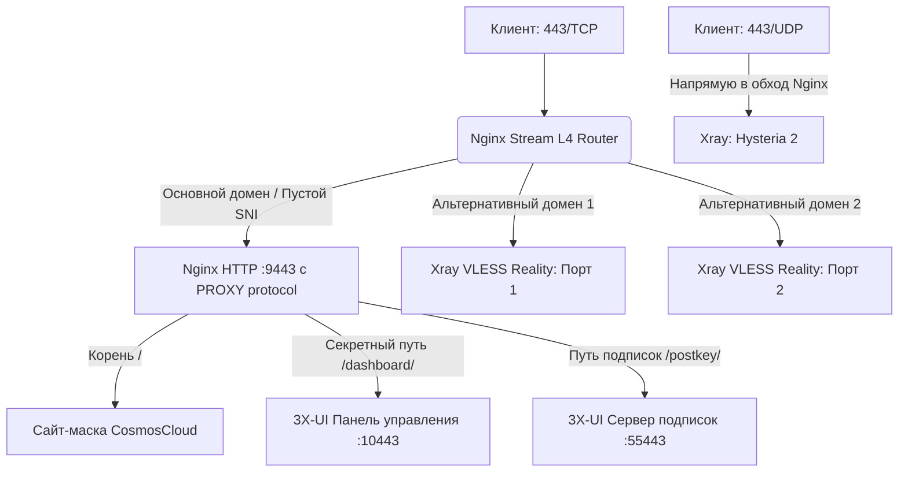

# Nginx L4 Stream Router & Mask for 3X-UI (v1.0.2 from ItMan75)

Автоматизированный скрипт для развертывания отказоустойчивой, высокопроизводительной и безопасной маскировки VPN-сервера на базе официальной сборки **Nginx (Stream L4 Router)** и панели **3X-UI**.

Полностью оптимизирован для архитектур **x86_64** и **ARM** (включая **Armbian** и **Ubuntu 24.04 Noble LTS**). Подходит как для мощных AMD/INTEL VPS, так и для одноплатных компьютеров.

---

## 🌟 Ключевые особенности и архитектура

* **Единый порт 443/TCP для всего:** На внешнем порту `443` работает умный Nginx Stream. Используя технологию `ssl_preread`, он анализирует SNI-заголовки запросов без дешифрации трафика:
* Запросы к **основному домену** уходят на внутренний изолированный веб-сервер Nginx для отображения сайта-маскировки.
* Запросы к **секретному пути панели** проксируются на внутренний веб-интерфейс 3X-UI.
* Запросы к **пути подписок (`/postkey/`)** проксируются на выделенный изолированный порт подписок.
* Запросы к **альтернативным доменам (SAN)** прозрачно перенаправляются на соответствующие локальные порты VLESS Reality.


* **Прямой биндинг Hysteria 2 (443/UDP):** Входной порт `443/UDP` резервируется под прямое подключение к Xray, минуя Nginx. Это гарантирует максимальную скорость и минимальный пинг для UDP-трафика.
* **Автоматизация SSL Let's Encrypt:** Полная интеграция с официальным Certbot (через Snap) для автоматического выпуска и продления мультидоменных сертификатов (SAN). Автоматический reload конфигурации Nginx после обновления сертификатов.
* **Кастомный интерактивный Decoy:** Встроенный шаблон маскировки, детально имитирующий интерфейс авторизации и API-заглушки приватного облака **CosmosCloud** (с передачей специфических заголовков вроде `X-Cosmoscloud-Version`).

---

## 📊 Схема движения трафика



---

## 🚀 Быстрый запуск

1. Склонируйте репозиторий или скачайте скрипт напрямую на сервер:
```bash
wget https://raw.githubusercontent.com/Itman75/Nginx-L4-Stream-Router-Mask-for-3x-ui/refs/heads/main/setup_mask.sh
chmod +x setup_mask.sh

```


2. Запустите скрипт от имени пользователя `root`:
```bash
sudo ./setup_mask.sh

```


3. Следуйте интерактивным инструкциям мастера установки.

---

## 🛠 Обязательная настройка после работы скрипта

> [!IMPORTANT]
> **ЗОЛОТОЕ ПРАВИЛО РАСПРЕДЕЛЕНИЯ СЕРТИФИКАТОВ:**
> Внутри панели 3X-UI **пути к файлам SSL-сертификатов везде должны оставаться пустыми**. Внешнее TLS-шифрование для панели, подписок и сайтов полностью берёт на себя Nginx.
> **Единственное исключение во всей панели — инбаунд Hysteria 2 (UDP).** Только в него прописываются пути к `.pem` файлам, так как Hysteria работает в обход Nginx.

### 1. Настройка инбаундов VLESS REALITY

Для каждого указанного вами порта Reality создайте отдельное подключение в панели:

* **Порт (Port):** Укажите один из ваших портов Reality (например, `45443`).
* **IP для прослушивания (Listen IP):** Строго впишите `127.0.0.1` (это скроет порты Reality от внешнего сканирования).
* **Сертификаты:** Ничего не включайте и не заполняйте. Reality использует собственную пару ключей (Private/Public Key), Let's Encrypt файлы ему **не нужны**.
* **Reality -> Dest / Server Names:** Укажите ваш альтернативный домен, привязанный к этому порту.
* *Важно для клиентов:* В конфигурации клиента порт подключения всегда должен быть **443**, а в поле SNI — ваш альтернативный домен.

```json
{
  "listen": "127.0.0.1",
  "port": 45443,
  "protocol": "vless",
  "tag": "in-45443-tcp",
  "settings": {
    "clients": [
      {
        "id": "ваш-uuid-клиента",
        "flow": "xtls-r-xtls-direct"
      }
    ],
    "decryption": "none"
  },
  "streamSettings": {
    "network": "tcp",
    "tcpSettings": {
      "acceptProxyProtocol": false,
      "header": {
        "type": "none"
      }
    },
    "security": "reality",
    "realitySettings": {
      "show": false,
      "xver": 1,
      "target": "127.0.0.1:9443",
      "serverNames": [
        "your.alternative.domain"
      ],
      "privateKey": "GJSXtcAWG3_YE4DVgs19bVy1QVAicooCpr5GSIFDK1A",
      "minClientVer": "",
      "maxClientVer": "",
      "maxTimediff": 0,
      "shortIds": [
        "d6ed260df64e16"
      ],
      "mldsa65Seed": "",
      "settings": {
        "publicKey": "blablabla8Luzq4H1pX38rXOHMQwB6kJO6sHzc",
        "fingerprint": "chrome",
        "serverName": "",
        "spiderX": "/",
        "mldsa65Verify": ""
      }
    },
    "externalProxy": [
      {
        "forceTls": "same",
        "dest": "your.alternative.domain",
        "port": 443,
        "remark": "",
        "sni": "",
        "alpn": [],
        "pinnedPeerCertSha256": []
      }
    ]
  }
}

```

---

### 2. Настройка инбаунда Hysteria 2 (UDP)

* **Порт (Port):** `443`
* **Протокол (Protocol):** `udp`
* **IP для прослушивания (Listen IP):** `0.0.0.0`
* **Сертификаты (TLS):** Здесь **обязательно** переключите безопасность в режим `TLS` и укажите полные пути к выпущенным Certbot'ом файлам Let's Encrypt (см. пример под спойлером).

```json
{
  "listen": "0.0.0.0",
  "port": 443,
  "protocol": "hysteria",
  "tag": "in-443-udp",
  "settings": {
    "clients": [
      {
        "auth": "ваш_пароль_авторизации"
      }
    ]
  },
  "streamSettings": {
    "network": "hysteria",
    "hysteriaSettings": {
      "version": 2,
      "udpIdleTimeout": 60
    },
    "security": "tls",
    "tlsSettings": {
      "serverName": "your.primary.domain",
      "minVersion": "1.3",
      "maxVersion": "1.3",
      "cipherSuites": "",
      "rejectUnknownSni": false,
      "disableSystemRoot": false,
      "enableSessionResumption": false,
      "certificates": [
        {
          "certificateFile": "/etc/letsencrypt/live/your.primary.domain/fullchain.pem",
          "keyFile": "/etc/letsencrypt/live/your.primary.domain/privkey.pem",
          "ocspStapling": 3600,
          "oneTimeLoading": false,
          "usage": "encipherment",
          "buildChain": false,
          "useFile": true
        }
      ],
      "alpn": [
        "h3"
      ],
      "echServerKeys": "",
      "settings": {
        "echConfigList": "",
        "pinnedPeerCertSha256": []
      }
    },
    "finalmask": {
      "udp": [
        {
          "type": "salamander",
          "settings": {
            "password": "blablabla"
          }
        }
      ]
    }
  }
}

```

---

### 3. Настройка системы подписок (Subscriptions)

Чтобы ссылки на подписки генерировались корректно через безопасный порт 443, примените следующие настройки:

1. Перейдите в **Настройки панели** -> вкладка **Настройки подписок**.
2. В поле **URI обратного прокси (Subscription URL template)** пропишите внешний адрес (порт указывать не нужно, так как по умолчанию используется стандартный 443):
```text
https://ВАШ_ГЛАВНЫЙ_ДОМЕН/postkey/

```


3. Убедитесь, что **Путь подписки (Subscription path)** равен: `/postkey/`.
4. **Порт подписки (Subscription port):** Сюда необходимо **строго прописать выделенный внутренний порт подписок** (тот, который вы указали как `SUB_PORT` на Шаге 2 при работе скрипта; по умолчанию предлагается `55443`). Это заставит панель открыть данный порт локально, и Nginx сможет перенаправлять на него трафик.
5. **Важно:** Убедитесь, что пути к SSL-сертификатам в настройках подписок пусты (внутренний сервер подписок должен слушать обычный HTTP на порту 55443).
6. Нажмите **Сохранить настройки** и перезапустите панель.

---

## 🔒 Настройка Файрвола (UFW / iptables)

Для обеспечения максимального уровня стелс-режима закройте все служебные порты от внешнего мира, оставив доступными только те, что необходимы для работы сервисов.

**Разрешить для внешних подключений (WAN):**

* `80/TCP` — для проверок Let's Encrypt (Certbot).
* `443/TCP` — единый вход для сайтов, панели, подписок и VLESS.
* `443/UDP` — для работы Hysteria2 напрямую.
* `[Ваш порт SSH]` — для управления сервером.

**Заблокировать для внешних подключений (доступ только локально):**

* Внутренний порт админ-панели 3X-UI (по умолчанию `10443`).
* Внутренний порт сервера подписок (по умолчанию `55443`).
* Все локальные порты Reality (`45443` и т.д.).

---

* Проект развертывается "как есть" (As Is) в образовательных целях для демонстрации возможностей маршрутизации трафика на L4/L7 уровнях модели OSI.

---
