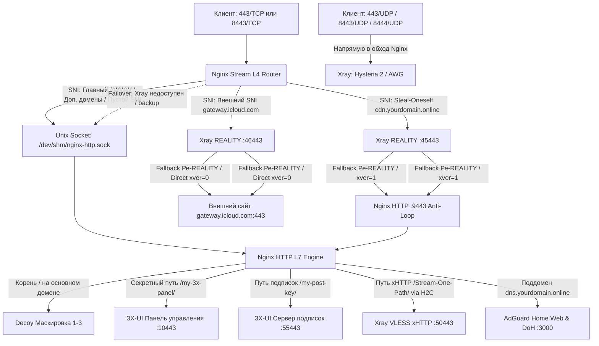

# 🛡️ Hardened VPS & Nginx L4 Stream Router Mask for 3X-UI (v6.5.3 Universal)

> **Высокопроизводительная серверная инфраструктура с нативным HTTP/2 Upstream шлюзом, скоростным транспортом Hysteria 2 (UDP 443), встроенным приватным DoH-резолвером AdGuard Home с раздельной маршрутизацией (Split-DNS), многоуровневой маскировкой, отказоустойчивой маршрутизацией доменов (L4 Failover), защитой от систем глубокого анализа пакетов (DPI / Active Probing) и полной изоляцией внутренних служб через сокеты в RAM.**  
> Развёртывается на чистых ОС семейств **Ubuntu (20.04 / 22.04 / 24.04)** и **Debian (11 / 12)**.

---

## 🌟 Ключевые возможности архитектуры v6.5.3 Universal

Комплекс состоит из скрипта первичной защиты операционной системы (**`secure-vps.sh`**) и интеллектуального L4/L7 маршрутизатора Nginx Mainline (**`setup_mask.sh` v6.5.3**), обеспечивая полную совместимость с ядром **Xray-core 24.9.27+ / 25.x / 26.x**:

### 1. Сценарий 1: Steal-Oneself REALITY (Кража у самого себя с Anti-Loop Port 9443 и L4 Failover)
* Выпуск легитимных SSL-сертификатов Let's Encrypt на собственные домены со строгой изоляцией (`--cert-name "$dom"`).
* Входящий TLS-поток маршрутизируется через Nginx Stream на локальный порт Xray REALITY (`127.0.0.1:45443`).
* **Защита Anti-Loop:** При подключении обычного веб-браузера или сканера активного зондирования Xray перенаправляет (*fallback*) запрос на изолированный слушатель **`127.0.0.1:9443`** (`xver: 1`), минуя внешний L4-роутер 443 и полностью исключая бесконечную петлю пересылки пакетов.
* **Резервный сокет (L4 Failover Backup):** В Stream-апстримы Reality интегрирован резервный сокет `server unix:/dev/shm/nginx-http.sock backup;`. Если Xray временно остановлен, перезагружается или ещё не настроен, Nginx автоматически перехватывает трафик и отдаёт маск-сайт с валидным SSL-сертификатом конкретного домена без ошибки отказа соединения (`Connection Refused`).

### 2. Сценарий 2: Classic External REALITY (Внешний камуфляж)
* Использование доверенных внешних доменов (`gateway.icloud.com`, `www.samsung.com`, `gateway.icloud.com` и др.) в качестве SNI.
* Каждому внешнему пулу назначается независимый локальный порт (`46443`, `47443` и т.д.), исключая коллизии и балансировочные таймауты.

### 3. Шлюз VLESS xHTTP (Stream-One/Up) + VLESSENC + XTLS-Vision (Zero-Drop Engine)
* **Нативное H2C-проксирование (`proxy_http_version 2`):** В Nginx Mainline проксирование к Xray xHTTP выполняется через честный протокол HTTP/2 без промежуточного преобразования в gRPC или деградации до HTTP/1.1.
* **Тюнинг буфера приёма (`http2_recv_buffer_size 16m`):** Расширенный буфер воркеров Nginx и сокетные Keepalive (`proxy_socket_keepalive on; tcp_nodelay on;`) исключают зависания и деградацию скорости при передаче тяжёлых файлов.
* **Поддержка режимов Stream-One и Stream-Up:** Nginx валидирует методы `GET` и `POST` (`if ($request_method !~ ^(GET|POST)$) { return 404; }`). Это обеспечивает как работу полнодуплексного `stream-one`, так и двухпоточного `stream-up` (где входящий поток Downlink использует метод `GET`).
* **Стабилизация буферов (`noSSEHeader: true`):** Отключение заголовков Server-Sent Events исключает задержки буферизации в Nginx и внешних CDN.
* **Сквозное шифрование `vlessenc` (ML-KEM-768 native):** Полезная нагрузка защищается симметричным квантово-устойчивым ключом шифрования на уровне протокола VLESS.
* **Совместимость с XTLS-Vision (`xtls-rprx-vision`):** В связке с VLESS Encryption алгоритм Vision работает на уровне протокола VLESS, обеспечивая 0-RTT проникновение (*penetration*) без двойного шифрования и динамический паддинг пакетов.
* **Архитектурный пул соединений XMUX:** Настройка пула `"maxConcurrency": "0"` совместно с явным `"maxConnections": "1-3"`, ротацией `"cMaxReuseTimes": "300-600"` и тайм-аутами ротации объединяет параллельные сессии в 1–3 TCP-соединения, минимизируя заметность хендшейков для систем DPI.
* **Паддинг заголовков:** Случайный мусор в HTTP-заголовках (`xPaddingBytes: 100-500`, ключ `X-Amz-Meta-Trace`).

### 4. Опциональный модуль AdGuard Home: Приватный DoH (DNS-over-HTTPS) + Split-DNS
* **Защита от блокировок провайдеров:** Домашний роутер (Keenetic, OpenWrt, MikroTik) или мобильные устройства обращаются к серверу по защищённому протоколу DoH (порт 443, TLS 1.3), обходя блокировки 53-го UDP-порта и публичных DNS (8.8.8.8, 1.1.1.1).
* **Защита от Open Resolver (ClientID):** Поддержка уникального токена в URL (`https://dns.domain.com/dns-query/SECRET_KEY`). Запросы от посторонних сканеров и ботов без токена сбрасываются со статусом `REFUSED`.
* **Эталонный пул апстримов (Split-DNS):**
  * Национальные домены (`.ru`, `.рф`, `.kz`, `.by`, `.su`) резолвятся через Яндекс DoH (`77.88.8.8:443`) для исключения проблем с гео-IP банков и госсервисов;
  * Видеосерверы YouTube и сервисы Google (`googlevideo.com`, `youtube.com`, `1e100.net` и др.) направляются на официальный HTTP/3-резолвер Google (`h3://dns.google/dns-query`) для устранения 4K-буферизации;
  * Все остальные мировые запросы обслуживаются сверхскоростными протоколами DNS-over-QUIC (DoQ) и HTTP/3 (Quad9, NextDNS, ControlD, AdGuard, Cloudflare).
* **Интеграция с VPN (3X-UI):** Весь трафик подключений VLESS, Hysteria 2 и AmneziaWG автоматически фильтруется AdGuard Home прямо на сервере при указании `127.0.0.1` в DNS панели.

### 5. Скоростные UDP-туннели: Hysteria 2 и AmneziaWG (UDP 443 / 8443 / 8444)
* **Hysteria 2 на `443/UDP`:** Сверхскоростной транспорт на базе протокола QUIC (HTTP/3) с маскировкой под веб-сервер и контроллером перегрузок BBR.
* **AmneziaWG v3.1 / v2.0:** Опциональная установка защиты Transport Protection для мобильных устройств, ПК и роутеров Keenetic / OpenWrt (порты `8443/UDP` и `8444/UDP`).
* Nginx Stream слушает только TCP, оставляя UDP-порты полностью свободными для прямого приёма пакетов серверами VPN.

### 6. Межпроцессная связь через Unix Sockets в RAM и Nginx Mainline
* Подключение официального репозитория `nginx.org` (ветка **Mainline**).
* Внутренний обмен между L4 Stream и L7 HTTP Core осуществляется через сокет в оперативной памяти (**`unix:/dev/shm/nginx-http.sock`**), исключая задержки виртуального loopback.
* Использование `ssl_reject_handshake on` на дефолтном сервере для мгновенного сброса сканеров по прямому IP без раскрытия SSL-сертификата.

### 7. Три автономных локальных режима маскировки (Decoy Fronts)
* **Режим 1 (Рекомендуемый):** Корпоративный IT SaaS *DataSphere Analytics* — интерактивный SPA-интерфейс в строгом стиле с геометрической координатной сферой, эмуляцией бекенд-API и Live телеметрией ±10%.
* **Режим 2:** Облачный портал *CosmosCloud* с эмуляцией API авторизации, верификацией графики и сессионными cookies.
* **Режим 3:** Стандартная заглушка веб-сервера (*Welcome to nginx!*).
* **Сквозная доступность:** Маск-сайт открывается по HTTPS на **всех** зарегистрированных на сервере доменах (основной, WWW, домены Steal-Oneself и дополнительные Direct-домены).

### 8. Двухрежимный гибридный SSL-движок
* **Certbot (HTTP-01):** Автоматический выпуск через Snapd с индивидуальной изоляцией сертификатов (`--cert-name "$dom"`) и деплой-хуками прав (`chmod 755 / 644`).
* **acme.sh (Cloudflare DNS-01):** Выпуск сертификатов через Cloudflare API (Token или Global Key) с выносом в `/etc/ssl/acme/`.

---

> [!CAUTION]
> ### ⚠️ Критическое требование к DNS в Cloudflare (Только «Серое облако» / DNS-Only)
> Все A/AAAA-записи для ваших доменов и поддоменов (включая поддомен DoH) в панели управления Cloudflare **обязаны** быть переведены в режим **DNS Only (Серое облако)**:
> * ❌ **Proxied (Оранжевое облако):** Запрещено! CDN Cloudflare терминирует TLS на собственных узлах, что делает невозможным работу L4 SNI Preread, Steal-Oneself REALITY и прямого HTTP/2 xHTTP стриминга.
> * ✔️ **DNS Only (Серое облако):** Трафик поступает напрямую на IP-адрес вашего сервера без вмешательства промежуточных прокси.

---

## 📊 Архитектурная схема движения трафика


```mermaid
graph TD
    Client443TCP[Клиент: 443/TCP или 8443/TCP] --> NginxStream(Nginx Stream L4 Router)
    Client443UDP[Клиент: 443/UDP / 8443/UDP / 8444/UDP] -->|Напрямую в обход Nginx| XrayHysteria[Xray: Hysteria 2 / AWG]

    NginxStream -->|SNI: Главный / WWW / Доп. домены / Пустой SNI| NginxSock[Unix Socket: /dev/shm/nginx-http.sock]
    NginxStream -->|SNI: Steal-Oneself cdn.yourdomain.online| XrayStealREALITY[Xray REALITY :45443]
    NginxStream -.->|Failover: Xray недоступен / backup| NginxSock
    NginxStream -->|SNI: Внешний SNI gateway.icloud.com| XrayClassicREALITY[Xray REALITY :46443]

    XrayStealREALITY -->|Fallback Ре-REALITY / xver=1| NginxFallbackHTTP[Nginx HTTP :9443 Anti-Loop]
    XrayClassicREALITY -->|Fallback Ре-REALITY / Direct xver=0| ExternalSite[Внешний сайт gateway.icloud.com:443]

    XrayStealREALITY -->|Fallback Ре-REALITY / xver=1| NginxFallbackHTTP[Nginx HTTP :9443 Anti-Loop]
    XrayClassicREALITY -->|Fallback Ре-REALITY / Direct xver=0| ExternalSite[Внешний сайт gateway.icloud.com:443]

    NginxSock --> NginxHTTPCore[Nginx HTTP L7 Engine]
    NginxFallbackHTTP --> NginxHTTPCore

    NginxHTTPCore -->|Корень / на основном домене| DecoySite[Decoy Маскировка 1-3]
    NginxHTTPCore -->|Секретный путь /my-3x-panel/| Panel3X[3X-UI Панель управления :10443]
    NginxHTTPCore -->|Путь подписок /my-post-key/| PanelSub[3X-UI Сервер подписок :55443]
    NginxHTTPCore -->|Путь xHTTP /Stream-One-Path/ via H2C| XrayXHTTP[Xray VLESS xHTTP :50443]
    NginxHTTPCore -->|Поддомен dns.yourdomain.online| AdGuardHome[AdGuard Home Web & DoH :3000]
```

---

## 📱 Совместимость клиентских приложений

| Платформа | Приложение | Поддерживаемые протоколы | Особенности |
| :--- | :--- | :--- | :--- |
| **Windows** | **v2rayN** / **Sing-box** / **NekoBox** | VLESS (xHTTP/REALITY/Vision), Hysteria 2, AWG, DoH | v2rayN v6.40+ (Xray-core v24.11+ / v25+) |
| **Android** | **v2rayNG** / **NekoBox** / **Sing-box** | VLESS (xHTTP/REALITY/Vision), Hysteria 2, AWG, DoH | v2rayNG v1.9.15+, поддержка Частного DNS |
| **iOS / iPadOS** | **Happ Proxy** / **FoXray** / **Streisand** / **Karing** | VLESS (xHTTP/REALITY/Vision), Hysteria 2, AWG, DoH | Актуальные версии из App Store |
| **macOS** | **V2RayXS** / **FoXray** / **NekoBox** | VLESS (xHTTP/REALITY/Vision), Hysteria 2, AWG, DoH | Нативная поддержка Xray-core |
| **Роутеры** | **Keenetic** / **OpenWrt** / **MikroTik** | VLESS REALITY, VLESS xHTTP, AWG v2.0, DoH | Нативная поддержка DoH с ClientID |

---

## 🛠️ Этап 1: Подготовка VPS и укрепление ОС (`secure-vps.sh`)

На первом шаге выполняется базовый аудит и hardening операционной системы, включение TCP BBR, перенос SSH на нестандартный порт, авторизация по ключам Ed25519, настройка UFW и первичная инсталляция панели **3X-UI** без локального SSL.

Выполните на чистом сервере с правами суперпользователя `root`:

```bash
wget https://raw.githubusercontent.com/Itman75/Nginx-L4-Stream-Router-Mask-for-3x-ui/main/secure-vps.sh
chmod +x secure-vps.sh
./secure-vps.sh
```

### Рекомендуемые ответы мастера `secure-vps.sh`:
* Обновление системы (apt upgrade) и очистка: `y`
* Установка системных утилит (htop, btop, curl и др.): `y`
* Включить TCP BBR и отключить IPv6: `y`
* Сменить пароль root: `y` (или `n`)
* Создать непривилегированного пользователя: `n`
* Настроить SSH ключи для ROOT: `y` -> Выбор `1` (Сгенерировать пару Ed25519) или `2` (Вставить свой Public Key). *При выборе 1 обязательно сохраните приватный ключ!*
* Изменить стандартный порт SSH: `y` -> Порт `60022` (или ваш выбор)
* Отключить вход по паролю: `y`
* Блокировать ICMP (Ping): `n`
* Установить 3x-ui: `y` -> Выбор `1` (Latest)
* **Параметры инсталлятора 3X-UI:**
  * Customize Panel Port: `y` -> Порт `10443`
  * SSL Certificate Setup: **`4` и `N`** *(Пропустить установку SSL в панели, так как TLS терминируется на Nginx)*

---

## 🚀 Этап 2: Развёртывание L4 Router, DoH и Маскировки (`setup_mask.sh` v6.5.3)

На втором шаге подключается официальный репозиторий Nginx Mainline, выпускаются изолированные SSL-сертификаты для всех доменов, разворачивается выбранная веб-маска, опционально настраивается AdGuard Home и конфигурируется L4/L7 маршрутизация.

Запустите скрипт автоматической настройки:

```bash
wget https://raw.githubusercontent.com/Itman75/Nginx-L4-Stream-Router-Mask-for-3x-ui/main/setup_mask.sh
chmod +x setup_mask.sh
./setup_mask.sh
```

### Пример интерактивного ввода параметров:
* **PRIMARY_DOMAIN (Главный домен):** `yourdomain.online`
* **Добавить алиас 'www.yourdomain.online'?** `y`
* **Steal-Oneself REALITY:** `y`
  * Локальный порт Xray: `45443`
  * Домены для порта 45443: `cdn.yourdomain.online`
  * Добавить ещё порт Steal-Oneself? `n`
* **Classic External REALITY:** `y`
  * Локальный порт Xray: `46443`
  * Внешний SNI: `gateway.icloud.com`
  * Добавить ещё порт Classic? `n`
* **Дополнительные SSL-домены:** *(Enter для завершения или ввод дополнительных Direct-доменов)*
* **Внутренний порт панели 3X-UI:** `10443`
* **Секретный URI-путь к веб-панели:** `my-3x-panel`
* **Внутренний порт сервера подписок:** `55443`
* **Секретный URI-путь подписок:** `my-post-key`
* **Внутренний порт VLESS xHTTP:** `50443`
* **URI-путь для xHTTP:** `Stream-One-Path`
* **Настройка Hysteria 2 / AmneziaWG:** `y` (выбор желаемых портов, например 443, 8443, 8444)
* **Настройка AdGuard Home DoH:** `y`
  * Поддомен для DoH и панели: `dns.yourdomain.online`
  * Логин администратора: `admin`
  * Пароль администратора: *(введите свой или используйте автосгенерированный)*
  * Секретный ClientID для роутера: `home-router`
* **Вариант маскировки (DECOY_MODE):** `1` *(DataSphere Analytics Enterprise)*, `2` *(CosmosCloud)* или `3` *(Nginx Stub)*
* **Метод сертификации:** `1` *(Certbot HTTP-01)* или `2` *(acme.sh + Cloudflare DNS-01)*

### 🤖 Неинтерактивный режим и автоматизация (.env)

Скрипт полностью поддерживает автоматическое развертывание и передачу параметров через конфигурационный файл без единого интерактивного вопроса.

**Доступные флаги CLI:**
* `-c, --config <FILE>` — Загрузить параметры из конфигурационного файла (.env).
* `-y, --yes, --non-interactive` — Включить тихий режим (автоматическое подтверждение всех этапов).
* `-d, --domain <DOMAIN>` — Быстро переопределить основной домен (PRIMARY_DOMAIN).
* `--gen-config [FILE]` — Сгенерировать шаблон конфигурации (по умолчанию `setup_mask.env.example`) и выйти.
* `-f, --force` — Игнорировать несоответствие DNS-записей (A-record) при проверке домена (удобно для CI/CD).
* `-h, --help` — Вывести справку.

**Примеры использования:**
```bash
# Шаг 1. Сгенерировать полный шаблон конфигурации (запуск без прав root):
./setup_mask.sh --gen-config my_settings.env

# Шаг 2. Отредактировать файл my_settings.env (заполнить домены, порты, токены CF)

# Шаг 3. Запустить полностью автоматическую установку (например, через Ansible):
./setup_mask.sh --config my_settings.env --non-interactive --force

# Альтернативно: использовать сохраненную сессию.
# Скрипт всегда автоматически сохраняет ваши ответы в 'setup_mask.env'.
# Если SSH-сессия оборвалась, вы можете продолжить установку одной командой:
./setup_mask.sh -c setup_mask.env -y
```

---

### Настройка брандмауэра UFW (Выполнить после setup_mask.sh и преднастройки панели 3X-UI)

> [!IMPORTANT]
> Скрипт `setup_mask.sh v6.5.3` автоматически считывает активный порт демона SSH (`SSH_DETECTED_PORT`) и включает его в список разрешённых правил, исключая потерю доступа к серверу при включении брандмауэра.

```bash
# 1. Разрешаем SSH (замените 60022 на ваш порт, если отличается), Веб, Hysteria 2 и AWG UDP
ufw allow 60022/tcp && ufw allow 80/tcp && ufw allow 443/tcp && ufw allow 8443/tcp
ufw allow 443/udp && ufw allow 8443/udp && ufw allow 8444/udp

# 2. Блокируем технические внутренние порты от внешнего сканирования
ufw deny 10443/tcp && ufw deny 55443/tcp && ufw deny 50443/tcp && ufw deny 9443/tcp && ufw deny 45443/tcp && ufw deny 46443/tcp && ufw deny 3000/tcp
```

### ⚡ Автоматическая настройка базы 3X-UI (`configure_3xui.sh`)

В проект включен вспомогательный скрипт **`configure_3xui.sh`**, который полностью автоматизирует конфигурирование панели 3X-UI и создание инбаундов напрямую в базе данных SQLite (`/etc/x-ui/x-ui.db`):
* Настраивает системные пути панели и сервера подписок (`webBasePath`, `subPort`, `subURI`, `subReverseProxy`).
* Генерирует криптографические ключи: UUID клиента, пару ключей REALITY (`x25519`), Reality Short ID, ключ дешифрования `vlessenc` (ML-KEM-768), пароль Hysteria 2 и ключи AmneziaWG.
* Создает все необходимые инбаунды: VLESS REALITY Steal-Oneself, Classic REALITY, VLESS xHTTP Stream-One, Hysteria 2 (UDP 443), AmneziaWG v3.1 / v2.0.
* Перезапускает службу `x-ui` (`systemctl restart x-ui`).

**Использование:**
При установке через `setup_mask.sh` мастер автоматически задает вопрос о запуске настройки 3X-UI. При ответе `y` (или наличии `AUTO_SETUP_3XUI="y"` в `.env`) скрипт выполнит всю настройку автономно.

Скрипт также можно запустить отдельно в любой момент:
```bash
./configure_3xui.sh --config setup_mask.env -y
```

---

## ⚙️ Пошаговая настройка 3X-UI в Веб-Интерфейсе (Ручной вариант)

### 1. Синхронизация путей панели и подписок

1. Откройте панель по адресу: `https://yourdomain.online/my-3x-panel/` (или по временному IP: `http://IP:10443/my-3x-panel/`)
2. Перейдите в **Настройки панели** -> **Панель**:
   * **URI-путь корневой папки панели:** `/my-3x-panel/`
   * Нажмите **Сохранить**.
3. Перейдите в **Настройки панели** -> **Подписка**:
   * Вкладка **Сертификаты**: Поля *Публичный ключ* и *Приватный ключ* оставьте **ПУСТЫМИ**!
   * **Порт подписки:** `55443`
   * **URI-путь подписки:** `/my-post-key/`
   * **URI обратного прокси:** `https://yourdomain.online/my-post-key/`
   * Нажмите **Сохранить** и выберите **Перезапустить панель**.

---

### 2. Конфигурирование Инбаундов в 3X-UI

В разделе **Входящие (Inbounds)** создайте подключения:

---

#### A. Инбаунд `VLESS_STEAL` (Steal-Oneself REALITY с защитой Anti-Loop)
* **Основное:** Порт `45443` | Listen IP `127.0.0.1` | Протокол `vless`
* **Поток:** Транспорт `tcp` | Accept Proxy Protocol: `1` (Включить) ⚠️
* **Безопасность:** `reality` | uTLS `chrome`
* **Flow:** `xtls-rprx-vision`
* **Цель (Dest):** `127.0.0.1:9443` ⚠️ *(Изолированный порт Anti-Loop Fallback)*
* **Proxy Protocol для Dest (xver):** `1` (Включить) ⚠️
* **Server Names (SNI):** `cdn.yourdomain.online`

---

#### B. Инбаунд `VLESS_CLASSIC` (Classic External REALITY)
* **Основное:** Порт `46443` | Listen IP `127.0.0.1` | Протокол `vless`
* **Поток:** Транспорт `tcp` | Accept Proxy Protocol: `1` (Включить) ⚠️
* **Безопасность:** `reality` | uTLS `chrome`
* **Flow:** `xtls-rprx-vision`
* **Цель (Target):** `gateway.icloud.com:443`
* **Proxy Protocol для Dest (xver):** `0` (Выключить) ⚠️
* **Server Names (SNI):** `gateway.icloud.com`

---

#### C. Инбаунд `VLESS_XHTTP` (Stream-One + VLESSENC + XTLS-Vision) 🚀
* **Основное:** Порт `50443` | Listen IP `127.0.0.1` | Протокол `vless`
* **Протокол (Decryption):** Выберите **ML-KEM-768 (native)** и нажмите **Сгенерировать** *(активирует квантово-устойчивое шифрование `vlessenc`)*.
* **Поток (Stream Settings):**
  * **Транспорт:** `xhttp` | **Режим:** `stream-one` *(при частых обрывах на длинных аплоадах смените на `stream-up`)*
  * **Путь:** `/Stream-One-Path/` | **Хост:** `yourdomain.online`
  * **Паддинг:** `100-500` | **xPaddingObfsMode:** `true` | **Ключ:** `X-Amz-Meta-Trace`
* **Безопасность:** `none` *(TLS снимает Nginx)* | Accept Proxy Protocol: `0` (Выключить)
* **Протокол:** В поле **Decryption** выберите **ML-KEM-768 (native)** и сгенерируйте ключ `vlessenc`.
* **Клиент (Client Settings):** Flow: **`xtls-rprx-vision`**, Decryption: сгенерированный ключ `vlessenc`.

---

#### D. Инбаунд `Hysteria 2 (UDP 443)`
* **Основное:** Порт `443` | Listen IP `0.0.0.0` | Протокол `hysteria` (v2)
* **Поток:** Masquerade: тип `proxy` -> URL: `http://127.0.0.1:80`
* **Безопасность:** `TLS` | SNI `yourdomain.online` | ALPN `h3`
* **Пути к сертификатам:**
  * Публичный ключ: `/etc/letsencrypt/live/yourdomain.online/fullchain.pem`
  * Приватный ключ: `/etc/letsencrypt/live/yourdomain.online/privkey.pem`

---

#### E. Инбаунд `AmneziaWG v3.1` (WG3 — UDP 8443)
* **Вкладка «Основное»:**
  * **Включить:** `Включено` | **Примечание:** `WG3` | **Протокол:** `amneziawg`
  * **Адрес:** `0.0.0.0` | **Порт:** `8443` | **Сброс трафика:** `Никогда`
* **Вкладка «Протокол»:**
  * **Ключи:** Сгенерировать новую пару ключей кнопкой обновления
  * **Подсеть:** `10.8.1.0` | **Маска (CIDR):** `24` | **MTU:** `1360`
  * **DNS:** `8.8.8.8` / `8.8.4.4` | **IPv6:** `Выключено`
* **Параметры обфускации:**
  * `Jc = 4`, `Jmin = 50`, `Jmax = 160`
  * `S1 = 45`, `S2 = 60`, `S3 = 24`, `S4 = 16`
  * `H1 – H4`: **Оставить ПУСТЫМИ** *(дефолты 1/2/3/4)*
  * `I1 – I5`: **Оставить ПУСТЫМИ**
  * `HeaderProtectionKey`: **Оставить ПУСТЫМ**
  * `ContentPaddingAddition`: `3-16`
  * `RekeyAfterTime`: `107-135` | `RekeyTimeout`: `3-4` | `RejectAfterTime`: `178-211`
  * `KeepaliveTimeout`: `8-10` | `MaxHandshakeAttempts`: `21-26`
  * `RandomTrailers`: `Выключено (OFF)` | `DisableCookies`: `Включено (ON)`

---

#### F. Инбаунд `AmneziaWG v2.0 / Legacy` (UDP 8444)
* **Основное:** Порт `8444` | Listen IP `0.0.0.0` | Протокол `amneziawg` / `wireguard`
* **Параметры AWG (Для роутеров Keenetic / OpenWrt и старых клиентов):**
  * H1-H4 (Строки): `"149419586", "878791997", "1251051976", "1657628296"`
  * HeaderProtectionKey: **ПУСТО (Выключено)**
  * S1 = 45, S2 = 60, S3 = 24, S4 = 16
  * Jc = 4, Jmin = 50, Jmax = 160 | MTU: `1360`

---

### 3. Автоматизация ссылок подписок (Раздел «Хосты» / Hosts) 💡

Для того чтобы клиенты автоматически подключались к VLESS xHTTP по внешнему порту 443 с корректным TLS-сертификатом, в разделе **Хосты** (`🌐`) панели 3X-UI создаются два правила:

#### Правило 1: Для REALITY и Hysteria 2 (`MAIN_SAME_443`)
* **Примечание:** `MAIN_SAME_443`
* **Входящие:** Отметьте: `VLESS_STEAL`, `VLESS_CLASSIC`, `Hysteria 2`.
* **Адрес (Target Address):** `yourdomain.online` | **Порт:** `443`
* **Безопасность:** `same` *(Сохраняет тип: REALITY остаётся reality, Hysteria — tls)*

#### Правило 2: Для VLESS xHTTP (`XHTTP_TLS_443`)
* **Примечание:** `XHTTP_TLS_443`
* **Входящие:** Отметьте только: `VLESS_XHTTP`.
* **Адрес (Target Address):** `yourdomain.online` | **Порт:** `443`
* **Безопасность:** `tls` ⚠️ *(Принудительно подставляет TLS для внешнего порта 443 Nginx)*
* **SNI:** `yourdomain.online` | **ALPN:** `h2` | **Fingerprint:** `chrome`

---

## 🛡️ Настройка и эксплуатация модуля AdGuard Home DoH

### 1. Доступ к панели управления
Панель AdGuard Home доступна исключительно по защищённому протоколу HTTPS:  
👉 **`https://dns.yourdomain.online/`** (Логин и пароль задаются на Шаге 9 скрипта).

### 2. Подключение домашнего роутера (на примере Keenetic)
1. Откройте панель управления Keenetic (`192.168.1.1`).
2. Перейдите в **«Сетевые правила» -> «Интернет-фильтр»** (или свойства подключения -> **«Серверы DNS»**).
3. Нажмите **«Добавить сервер DNS»**:
   * **Адрес сервера DNS (Bootstrap):** `IP_ВАШЕГО_VPS` *(нужен для первичного поиска домена)*
   * **Протокол:** `DNS-over-HTTPS (DoH)`
   * **URL-адрес DoH:** `https://dns.yourdomain.online/dns-query/home-router` *(где `home-router` — секретный ClientID)*
   * **Доменное имя (SNI):** `dns.yourdomain.online`
4. Поставьте галочку **«Игнорировать DNS провайдера»** и сохраните.

> [!TIP]
> **Как работает защита ClientID:**  
> Если посторонний бот или сканер отправит запрос на общий адрес `https://dns.yourdomain.online/dns-query`, сервер вернёт отказ `REFUSED`. Запросы обрабатываются **только** при наличии секретного токена `home-router`.

### 3. Фильтрация рекламы внутри VPN (3X-UI)
1. В панели 3X-UI перейдите в **«Настройки панели» -> «Настройки Xray»**.
2. В конфигурации блока **DNS** пропишите первым сервером: `127.0.0.1`.
3. Перезапустите Xray. Весь трафик подключений VLESS, Hysteria 2 и AmneziaWG начнёт автоматически очищаться от рекламы и трекеров прямо на сервере!

---

## 🩺 Экспресс-диагностика и проверка узлов (Health Check)

```bash
# 1. Проверка синтаксиса и статуса Nginx
nginx -t && systemctl status nginx --no-pager

# 2. Проверка активности сокета в оперативной памяти
ls -la /dev/shm/nginx-http.sock

# 3. Тест доступности маскировочного сайта через HTTP/2 на главном домене
curl -Iv --http2 https://yourdomain.online

# 4. Проверка доступности маск-сайта на Steal-Oneself домене (должен отдавать маску без ошибок)
curl -Iv --http2 https://cdn.yourdomain.online

# 5. Тест шлюза xHTTP (должен возвращать 404 Not Found, подтверждая активность защищённой локации)
curl -Iv --http2 https://yourdomain.online/Stream-One-Path/

# 6. Тест приватного DoH (должен вернуть HTTP 200 и бинарный DNS-ответ)
curl -Iv "https://dns.yourdomain.online/dns-query/home-router?dns=AAABAAABAAAAAAAAA3d3dwdleGFtcGxlA2NvbQAAAQAB"

# 7. Проверка доступности портов UDP (Hysteria / AWG)
nc -zvu 127.0.0.1 443
nc -zvu 127.0.0.1 8443
nc -zvu 127.0.0.1 8444

# 8. Мониторинг логов Nginx в реальном времени
tail -f /var/log/nginx/access.log
tail -f /var/log/nginx/error.log
```

---

## 🔄 Автоматическое продление SSL-сертификатов

Сертификаты обновляются в полностью автоматическом режиме:
* **Certbot:** Системный таймер `snap.certbot.renew.timer` запускается дважды в сутки. При успешном продлении срабатывает скрипт-хук `/etc/letsencrypt/renewal-hooks/deploy/nginx-reload.sh`, который нормализует права доступа (`chmod 755 / 644`) для чтения демонами `nginx` и `nobody (Xray)` и выполняет перезагрузку `systemctl reload nginx`.
* **acme.sh:** Обновление контролируется заданием Cron (`cron`), вызывающим установку обновлённых сертификатов в `/etc/ssl/acme/` с перезагрузкой веб-сервера.

Для принудительной проверки продления вручную:
```bash
# Для Certbot:
certbot renew --dry-run

# Для acme.sh:
~/.acme.sh/acme.sh --cron --home ~/.acme.sh
```

---

## 💾 Резервное копирование и восстановление

Для предотвращения повреждения базы данных SQLite (`x-ui.db`) и журналов WAL резервное копирование и восстановление выполняются с кратковременной остановкой служб (на 1–2 секунды). Также архивируется весь каталог `/etc/x-ui/`, а не только один файл базы.

### Создание резервной копии:
```bash
# Кратковременно останавливаем службы для консистентного слепка БД без блокировок
systemctl stop x-ui AdGuardHome 2>/dev/null || true

# Создание архива (каталог /etc/x-ui архивируется целиком со всеми журналами)
tar -czvf backup_proxy_$(date +%F).tar.gz \
  /etc/nginx \
  /etc/letsencrypt \
  /etc/ssl/acme \
  /opt/AdGuardHome/AdGuardHome.yaml \
  /etc/x-ui \
  /var/www/html

# Запускаем службы обратно
systemctl start x-ui AdGuardHome 2>/dev/null || true
```

### Восстановление из резервной копии:
```bash
# 1. ОБЯЗАТЕЛЬНО останавливаем службы перед заменой файлов
systemctl stop x-ui nginx AdGuardHome 2>/dev/null || true

# 2. Удаляем остаточные файлы блокировок и журналов WAL текущей сессии
rm -f /etc/x-ui/x-ui.db-wal /etc/x-ui/x-ui.db-shm

# 3. Распаковываем архив в корень системы
tar -xzvf backup_proxy_YYYY-MM-DD.tar.gz -C /

# 4. Проверяем синтаксис Nginx и безопасно запускаем службы
nginx -t && systemctl start nginx x-ui AdGuardHome

---

### Что изменилось:
* `/etc/x-ui` теперь архивируется **целиком** как каталог (включая саму базу и возможные журналы транзакций).
* В AdGuard Home архивируется его файл настроек `/opt/AdGuardHome/AdGuardHome.yaml` вместо попытки заархивировать огромный бинарный лог запросов.
* Перед распаковкой удаляются `x-ui.db-wal` и `x-ui.db-shm`, благодаря чему SQLite запускается с чистой гарантированно рабочей базы.
---

## 📄 Готовые JSON-шаблоны Инбаундов Xray

<details>
<summary><b>1. JSON: VLESS REALITY Steal-Oneself (Порт 45443, Anti-Loop Dest 9443)</b></summary>

```json
{
  "listen": "127.0.0.1",
  "port": 45443,
  "protocol": "vless",
  "tag": "in-steal-reality",
  "settings": {
    "clients": [
      {
        "id": "ВАШ_UUID",
        "flow": "xtls-rprx-vision"
      }
    ],
    "decryption": "none"
  },
  "sniffing": {
    "enabled": true,
    "destOverride": ["http", "tls", "quic", "fakedns"]
  },
  "streamSettings": {
    "network": "tcp",
    "tcpSettings": {
      "acceptProxyProtocol": true
    },
    "security": "reality",
    "realitySettings": {
      "show": false,
      "xver": 1,
      "dest": "127.0.0.1:9443",
      "serverNames": [
        "cdn.yourdomain.online"
      ],
      "privateKey": "ВАШ_PRIVATE_KEY",
      "shortIds": [
        "4231428749e19e67"
      ]
    }
  }
}
```
</details>

<details>
<summary><b>2. JSON: VLESS REALITY Classic External (Порт 46443)</b></summary>

```json
{
  "listen": "127.0.0.1",
  "port": 46443,
  "protocol": "vless",
  "tag": "in-classic-reality",
  "settings": {
    "clients": [
      {
        "id": "ВАШ_UUID",
        "flow": "xtls-rprx-vision"
      }
    ],
    "decryption": "none"
  },
  "sniffing": {
    "enabled": true,
    "destOverride": ["http", "tls", "quic", "fakedns"]
  },
  "streamSettings": {
    "network": "tcp",
    "tcpSettings": {
      "acceptProxyProtocol": true
    },
    "security": "reality",
    "realitySettings": {
      "show": false,
      "xver": 0,
      "dest": "gateway.icloud.com:443",
      "serverNames": [
        "gateway.icloud.com"
      ],
      "privateKey": "ВАШ_PRIVATE_KEY",
      "shortIds": [
        "5a4cf5b5fe43f6be"
      ]
    }
  }
}
```
</details>

<details>
<summary><b>3. JSON: VLESS xHTTP Stream-One/Up + VLESSENC + XMUX Pool + Vision (Порт 50443)</b></summary>

```json
{
  "listen": "127.0.0.1",
  "port": 50443,
  "protocol": "vless",
  "tag": "in-xhttp-vision",
  "settings": {
    "clients": [
      {
        "id": "ВАШ_UUID",
        "flow": "xtls-rprx-vision"
      }
    ],
    "decryption": "ВАШ_VLESSENC_KEY"
  },
  "sniffing": {
    "enabled": true,
    "destOverride": ["http", "tls", "quic", "fakedns"]
  },
  "streamSettings": {
    "network": "xhttp",
    "xhttpSettings": {
      "path": "/Stream-One-Path/",
      "host": "yourdomain.online",
      "mode": "stream-one",
      "noSSEHeader": true,
      "xPaddingBytes": "100-500",
      "xPaddingObfsMode": true,
      "xPaddingKey": "X-Amz-Meta-Trace",
      "xmux": {
        "maxConcurrency": "0",
        "maxConnections": "1-3",
        "cMaxReuseTimes": "300-600",
        "hKeepAlivePeriod": 600,
        "hMaxRequestTimes": "1000-2000",
        "hMaxReusableSecs": "1200-2400"
      }
    },
    "security": "none"
  }
}
```
</details>

<details>
<summary><b>4. JSON: Hysteria 2 UDP (Порт 443)</b></summary>

```json
{
  "listen": "0.0.0.0",
  "port": 443,
  "protocol": "hysteria",
  "tag": "in-hysteria2",
  "settings": {
    "clients": [
      {
        "id": "ВАШ_ПАРОЛЬ_АВТОРИЗАЦИИ"
      }
    ],
    "version": 2
  },
  "sniffing": {
    "enabled": true,
    "destOverride": ["http", "tls", "quic", "fakedns"]
  },
  "streamSettings": {
    "network": "hysteria",
    "hysteriaSettings": {
      "version": 2,
      "udpIdleTimeout": 60,
      "masquerade": {
        "type": "proxy",
        "url": "http://127.0.0.1:80"
      }
    },
    "security": "tls",
    "tlsSettings": {
      "serverName": "yourdomain.online",
      "minVersion": "1.3",
      "maxVersion": "1.3",
      "certificates": [
        {
          "certificateFile": "/etc/letsencrypt/live/yourdomain.online/fullchain.pem",
          "keyFile": "/etc/letsencrypt/live/yourdomain.online/privkey.pem"
        }
      ],
      "alpn": [
        "h3"
      ]
    }
  }
}
```
</details>

<details>
<summary><b>5. JSON: AmneziaWG v3.1 (Transport Protection — Порт 8443)</b></summary>

```json
{
  "listen": "0.0.0.0",
  "port": 8443,
  "protocol": "amneziawg",
  "tag": "in-8443-udp",
  "settings": {
    "clients": [
      {
        "privateKey": "ВАШ_PRIVATE_KEY_СЕРВЕРА",
        "publicKey": "PUBLIC_KEY_КЛИЕНТА",
        "allowedIPs": [
          "10.8.1.2/32"
        ],
        "forwardedPorts": "",
        "email": "My",
        "limitIp": 0,
        "totalGB": 0,
        "expiryTime": 0,
        "enable": true,
        "tgId": 0,
        "subId": "Mine",
        "comment": "",
        "reset": 0,
        "created_at": 1779267590000,
        "updated_at": 1788840887000
      }
    ],
    "server": {
      "contentPaddingAddition": "3-16",
      "disableCookies": true,
      "h1": "",
      "h2": "",
      "h3": "",
      "h4": "",
      "jc": 4,
      "jmax": 160,
      "jmin": 50,
      "keepaliveTimeout": "8-10",
      "maxHandshakeAttempts": "21-26",
      "mtu": 1360,
      "primaryDns": "8.8.8.8",
      "privateKey": "ВАШ_PRIVATE_KEY_СЕРВЕРА",
      "publicKey": "PUBLIC_KEY_КЛИЕНТА",
      "randomTrailers": false,
      "rejectAfterTime": "178-211",
      "rekeyAfterTime": "107-135",
      "rekeyTimeout": "3-4",
      "s1": 45,
      "s2": 60,
      "s3": 24,
      "s4": 16,
      "secondaryDns": "8.8.4.4",
      "subnetCidr": 24,
      "subnetIp": "10.8.1.0"
    }
  }
}
```
</details>

<details>
<summary><b>6. JSON: AmneziaWG v2.0 / Legacy (Для Роутеров — Порт 8444)</b></summary>

```json
{
  "listen": "0.0.0.0",
  "port": 8444,
  "protocol": "amneziawg",
  "tag": "in-awg-v2-legacy",
  "settings": {
    "accounts": [
      "ВАШ_PRIVATE_KEY_СЕРВЕРА"
    ],
    "peers": [
      {
        "publicKey": "PUBLIC_KEY_КЛИЕНТА",
        "allowedIps": ["10.0.0.3/32"]
      }
    ],
    "mtu": 1360,
    "awg": {
      "h1": 149419586,
      "h2": 878791997,
      "h3": 1251051976,
      "h4": 1657628296,
      "jc": 4,
      "jmin": 50,
      "jmax": 160,
      "s1": 45,
      "s2": 60,
      "s3": 24,
      "s4": 16,
      "headerProtectionKey": ""
    }
  }
}
