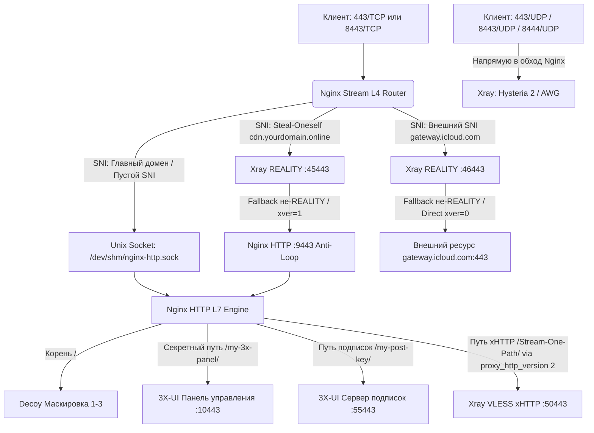

# 🛡️ Hardened VPS & Nginx L4 Stream Router Mask for 3X-UI (v6.5.1 Universal)

> **Высокопроизводительная серверная инфраструктура с нативным HTTP/2 Upstream шлюзом, скоростным транспортом Hysteria 2 (UDP 443), многоуровневой маскировкой, защитой от систем глубокого анализа пакетов (DPI / Active Probing) и полной изоляцией внутренних служб через сокеты в RAM.**  
> Развёртывается на чистых ОС семейств **Ubuntu (20.04 / 22.04 / 24.04)** и **Debian (11 / 12)**.

---

## 🌟 Ключевые возможности архитектуры v6.5.1 Universal

Комплекс состоит из скрипта первичной защиты операционной системы (**`secure-vps.sh`**) и интеллектуального L4/L7 маршрутизатора Nginx Mainline (**`setup_mask.sh` v6.5.1**), обеспечивая полную совместимость с ядром **Xray-core 24.9.27+ / 25.x / 26.x**:

### 1. Сценарий 1: Steal-Oneself REALITY (Кража у самого себя с Anti-Loop Port 9443)
* Выпуск легитимных SSL-сертификатов Let's Encrypt на собственные домены.
* Входящий TLS-поток маршрутизируется через Nginx Stream на локальный порт Xray REALITY (`127.0.0.1:45443`).
* **Защита Anti-Loop:** При подключении обычного веб-браузера или сканера активного зондирования Xray перенаправляет (*fallback*) запрос на изолированный слушатель **`127.0.0.1:9443`** (`xver: 1`), минуя внешний L4-роутер 443 и полностью исключая бесконечную петлю пересылки пакетов.

### 2. Сценарий 2: Classic External REALITY (Внешний камуфляж)
* Использование доверенных внешних доменов (`gateway.icloud.com`, `www.samsung.com`, `gateway.icloud.com` и др.) в качестве SNI.
* Каждому внешнему пулу назначается независимый локальный порт (`46443`, `47443` и т.д.), исключая коллизии и балансировочные таймауты.

### 3. Шлюз VLESS xHTTP (Stream-One) + VLESSENC + XTLS-Vision via Native HTTP/2
* **Нативное H2C-проксирование (`proxy_http_version 2`):** В Nginx Mainline (1.31.4+) проксирование к Xray xHTTP выполняется через честный протокол HTTP/2 без промежуточного преобразования в gRPC или деградации до HTTP/1.1.
* **Тюнинг буфера приёма (`http2_recv_buffer_size 16m`):** Расширенный буфер воркеров Nginx исключает узкие места при передаче тяжёлых потоковых медиаданных.
* **Полнодуплексный стриминг без задержек:** Отключение буферизации тела (`proxy_request_buffering off; proxy_buffering off;`) обеспечивает сквозной двунаправленный обмен фреймами.
* **Сквозное шифрование `vlessenc`:** Полезная нагрузка защищается постквантовым симметричным ключом шифрования (ML-KEM-768 / VLESS Encryption) на уровне протокола VLESS.
* **XTLS-Vision поверх xHTTP:** В клиентах с версией ядра **Xray 24.9.27+** активируется `flow: xtls-rprx-vision` совместно с `vlessenc` для динамического паддинга и маскировки под стандартный веб-трафик.
* **Паддинг заголовков:** Случайный мусор в HTTP-заголовках (`xPaddingBytes: 100-500`, ключ `X-Amz-Meta-Trace`).

### 4. Скоростные UDP-туннели: Hysteria 2 и AmneziaWG (UDP 443 / 8443 / 8444)
* **Hysteria 2 на `443/UDP`:** Сверхскоростной транспорт на базе протокола QUIC (HTTP/3) с маскировкой под веб-сервер и контроллером перегрузок BBR.
* **AmneziaWG v3.1 / v2.0:** Опциональная установка защиты Transport Protection для мобильных устройств, ПК и роутеров Keenetic / OpenWrt (порты `8443/UDP` и `8444/UDP`).
* Nginx Stream слушает только TCP, оставляя UDP-порты полностью свободными для прямого приёма пакетов серверами VPN.

### 5. Межпроцессная связь через Unix Sockets в RAM и Nginx Mainline
* Подключение официального репозитория `nginx.org` (ветка **Mainline**).
* Внутренний обмен между L4 Stream и L7 HTTP Core осуществляется через сокет в оперативной памяти (**`unix:/dev/shm/nginx-http.sock`**), исключая задержки виртуального loopback.
* Использование `ssl_reject_handshake on` на дефолтном сервере для мгновенного сброса сканеров по прямому IP без раскрытия SSL-сертификата.

### 6. 3 автономных локальных режима маскировки (Decoy Fronts)
* **Режим 1 (Рекомендуемый):** Корпоративный IT SaaS *DataSphere Analytics* — интерактивный SPA-интерфейс в строгом стиле с геометрическим логотипом, эмуляцией бекенд-API и Live телеметрией ±10%.
* **Режим 2:** Облачный портал *CosmosCloud* с эмуляцией API авторизации, верификацией графики и сессионными cookies.
* **Режим 3:** Стандартная заглушка веб-сервера (*Welcome to nginx!*).

### 7. Двухрежимный гибридный SSL-движок
* **Certbot (HTTP-01):** Автоматический выпуск через Snapd с деплой-хуками нормализации прав (`chmod 755 / 644`).
* **acme.sh (Cloudflare DNS-01):** Выпуск сертификатов через Cloudflare API (Token или Global Key), включая Wildcard-сертификаты.

---

> [!CAUTION]
> ### ⚠️ Критическое требование к DNS в Cloudflare (Только «Серое облако» / DNS-Only)
> Все A/AAAA-записи для ваших доменов в панели управления Cloudflare **обязаны** быть переведены в режим **DNS Only (Серое облако)**:
> * ❌ **Proxied (Оранжевое облако):** Запрещено! CDN Cloudflare терминирует TLS на собственных узлах, что делает невозможным работу L4 SNI Preread, Steal-Oneself REALITY и прямого HTTP/2 xHTTP стриминга.
> * ✔️ **DNS Only (Серое облако):** Трафик поступает напрямую на IP-адрес вашего сервера без вмешательства промежуточных прокси.

---

## 📊 Архитектурная схема движения трафика


```mermaid
graph TD
    Client443TCP[Клиент: 443/TCP или 8443/TCP] --> NginxStream(Nginx Stream L4 Router)
    Client443UDP[Клиент: 443/UDP / 8443/UDP / 8444/UDP] -->|Напрямую в обход Nginx| XrayHysteria[Xray: Hysteria 2 / AWG]

    NginxStream -->|SNI: Главный домен / Пустой SNI| NginxSock[Unix Socket: /dev/shm/nginx-http.sock]
    NginxStream -->|SNI: Steal-Oneself cdn.yourdomain.online| XrayStealREALITY[Xray REALITY :45443]
    NginxStream -->|SNI: Внешний SNI gateway.icloud.com| XrayClassicREALITY[Xray REALITY :46443]

    XrayStealREALITY -->|Fallback не-REALITY / xver=1| NginxFallbackHTTP[Nginx HTTP :9443 Anti-Loop]
    XrayClassicREALITY -->|Fallback не-REALITY / Direct xver=0| ExternalSite[Внешний ресурс gateway.icloud.com:443]

    NginxSock --> NginxHTTPCore[Nginx HTTP L7 Engine]
    NginxFallbackHTTP --> NginxHTTPCore

    NginxHTTPCore -->|Корень /| DecoySite[Decoy Маскировка 1-3]
    NginxHTTPCore -->|Секретный путь /my-3x-panel/| Panel3X[3X-UI Панель управления :10443]
    NginxHTTPCore -->|Путь подписок /my-post-key/| PanelSub[3X-UI Сервер подписок :55443]
    NginxHTTPCore -->|Путь xHTTP /Stream-One-Path/ via proxy_http_version 2| XrayXHTTP[Xray VLESS xHTTP :50443]
```

---

## 📱 Совместимость клиентских приложений

Для полноценной работы стека протоколов клиентское ПО должно поддерживать соответствующие транспорты, шифрование и обфускацию:

| Платформа | Приложение | Поддерживаемые протоколы | Особенности |
| :--- | :--- | :--- | :--- |
| **Windows** | **v2rayN** / **Sing-box** / **NekoBox** | VLESS (xHTTP/REALITY/Vision), Hysteria 2, AWG | v2rayN v6.40+ (Xray-core v24.11+) |
| **Android** | **v2rayNG** / **NekoBox** / **Sing-box** | VLESS (xHTTP/REALITY/Vision), Hysteria 2, AWG | v2rayNG v1.9.15+, NekoBox v1.3.1+ |
| **iOS / iPadOS** | **Happ Proxy** / **FoXray** / **Streisand** / **Karing** | VLESS (xHTTP/REALITY/Vision), Hysteria 2, AWG | Актуальные версии из App Store |
| **macOS** | **V2RayXS** / **FoXray** / **NekoBox** | VLESS (xHTTP/REALITY/Vision), Hysteria 2, AWG | Нативная поддержка Xray-core |
| **Роутеры** | **Keenetic** / **OpenWrt** | VLESS REALITY, VLESS xHTTP, AWG v2.0 | Пакеты Xray-core / Sing-box |

---

## 🛠️ Этап 1: Подготовка VPS и укрепление ОС (`secure-vps.sh`)

На первом шаге выполняется базовый аудит и hardening операционной системы, включение TCP BBR, перенос SSH на нестандартный порт, авторизация по ключам Ed25519, настройка UFW и первичная инсталляция панели **3X-UI** без локального SSL.

Выполните на чистом сервере с правами суперпользователя `root`:

```bash
wget https://raw.githubusercontent.com/Itman75/Nginx-L4-Stream-Router-Mask-for-3x-ui/main/secure-vps.sh
chmod +x secure-vps.sh
./secure-vps.sh
```

### Рекомендуемые ответы мастера `secure-vps.sh`:
* Обновление системы (apt upgrade) и очистка: `y`
* Установка системных утилит (htop, btop, curl и др.): `y`
* Включить TCP BBR и отключить IPv6: `y`
* Сменить пароль root: `y` (или `n`)
* Создать непривилегированного пользователя: `n`
* Настроить SSH ключи для ROOT: `y` -> Выбор `1` (Сгенерировать пару Ed25519) или `2` (Вставить свой Public Key). *При выборе 1 обязательно сохраните приватный ключ!*
* Изменить стандартный порт SSH: `y` -> Порт `60022`
* Отключить вход по паролю: `y`
* Блокировать ICMP (Ping): `n`
* Установить 3x-ui: `y` -> Выбор `1` (Latest)
* **Параметры инсталлятора 3X-UI:**
  * Customize Panel Port: `y` -> Порт `10443`
  * SSL Certificate Setup: **`4` и `N`** *(Пропустить установку SSL в панели, так как TLS терминируется на Nginx)*

---

## 🚀 Этап 2: Развёртывание L4 Router и Маскировки (`setup_mask.sh` v6.5.1)

На втором шаге подключается официальный репозиторий Nginx Mainline, генерируются SSL-сертификаты, разворачивается выбранная веб-маска и применяется комплексная матрица безопасности.

Запустите скрипт автоматической настройки:

```bash
wget https://raw.githubusercontent.com/Itman75/Nginx-L4-Stream-Router-Mask-for-3x-ui/main/setup_mask.sh
chmod +x setup_mask.sh
./setup_mask.sh
```

### Пример интерактивного ввода параметров (со значениями по умолчанию):
* **PRIMARY_DOMAIN (Главный домен):** `yourdomain.online`
* **Добавить алиас 'www.yourdomain.online'?** `y`
* **Steal-Oneself REALITY:** `y`
  * Локальный порт Xray: `45443`
  * Домены для порта 45443: `cdn.yourdomain.online`
  * Добавить ещё порт Steal-Oneself? `n` (или `y` для настройки доп. портов)
* **Classic External REALITY:** `y`
  * Локальный порт Xray: `46443`
  * Внешний SNI: `gateway.icloud.com`
  * Добавить ещё порт Classic? `n`
* **Дополнительные SSL-домены:** *(Enter для завершения)*
* **Внутренний порт панели 3X-UI:** `10443`
* **Секретный URI-путь к веб-панели:** `my-3x-panel`
* **Внутренний порт сервера подписок:** `55443`
* **Секретный URI-путь подписок:** `my-post-key`
* **Внутренний порт VLESS xHTTP:** `50443`
* **URI-путь для xHTTP:** `Stream-One-Path`
* **Настройка Hysteria 2 / AmneziaWG:** `y` (выбор желаемых портов, например 443, 8443, 8444)
* **Вариант маскировки (DECOY_MODE):** `1` *(DataSphere Analytics)*, `2` *(CosmosCloud)* или `3` *(Nginx Stub)*
* **Метод сертификации:** `1` *(Certbot HTTP-01)* или `2` *(acme.sh + Cloudflare DNS-01)*

### 🤖 Неинтерактивный режим и автоматизация (.env)

Скрипт полностью поддерживает автоматическое развертывание и передачу параметров через конфигурационный файл без единого интерактивного вопроса.

**Доступные флаги CLI:**
* `-c, --config <FILE>` — Загрузить параметры из конфигурационного файла (.env).
* `-y, --yes, --non-interactive` — Включить тихий режим (автоматическое подтверждение всех этапов).
* `-d, --domain <DOMAIN>` — Быстро переопределить основной домен (PRIMARY_DOMAIN).
* `--gen-config [FILE]` — Сгенерировать шаблон конфигурации (по умолчанию `setup_mask.env.example`) и выйти.
* `-f, --force` — Игнорировать несоответствие DNS-записей (A-record) при проверке домена (удобно для CI/CD).
* `-h, --help` — Вывести справку.

**Примеры использования:**
```bash
# Шаг 1. Сгенерировать полный шаблон конфигурации (запуск без прав root):
./setup_mask.sh --gen-config my_settings.env

# Шаг 2. Отредактировать файл my_settings.env (заполнить домены, порты, токены CF)

# Шаг 3. Запустить полностью автоматическую установку (например, через Ansible):
./setup_mask.sh --config my_settings.env --non-interactive --force

# Альтернативно: использовать сохраненную сессию.
# Скрипт всегда автоматически сохраняет ваши ответы в 'setup_mask.env'.
# Если SSH-сессия оборвалась, вы можете продолжить установку одной командой:
./setup_mask.sh -c setup_mask.env -y
```

---

### Настройка брандмауэра UFW (Выполнить после setup_mask.sh и преднастройки панели 3X-UI)

Заблокируйте прямой доступ к внутренним техническим портам снаружи и откройте внешние точки входа VPN:

```bash
# Разрешаем внешние сетевые точки входа (Веб, REALITY, Hysteria 2 / AWG UDP и резервный 8443/TCP)
ufw allow 80/tcp && ufw allow 443/tcp && ufw allow 8443/tcp
ufw allow 443/udp && ufw allow 8443/udp && ufw allow 8444/udp

# Блокируем технические внутренние сокеты и порт Anti-Loop Fallback
ufw deny 10443/tcp && ufw deny 55443/tcp && ufw deny 50443/tcp && ufw deny 9443/tcp && ufw deny 45443/tcp && ufw deny 46443/tcp
```

### ⚡ Автоматическая настройка базы 3X-UI (`configure_3xui.sh`)

В проект включен вспомогательный скрипт **`configure_3xui.sh`**, который полностью автоматизирует конфигурирование панели 3X-UI и создание инбаундов напрямую в базе данных SQLite (`/etc/x-ui/x-ui.db`):
* Настраивает системные пути панели и сервера подписок (`webBasePath`, `subPort`, `subURI`, `subReverseProxy`).
* Генерирует криптографические ключи: UUID клиента, пару ключей REALITY (`x25519`), Reality Short ID, ключ дешифрования `vlessenc` (ML-KEM-768), пароль Hysteria 2 и ключи AmneziaWG.
* Создает все необходимые инбаунды: VLESS REALITY Steal-Oneself, Classic REALITY, VLESS xHTTP Stream-One, Hysteria 2 (UDP 443), AmneziaWG v3.1 / v2.0.
* Перезапускает службу `x-ui` (`systemctl restart x-ui`).

**Использование:**
При установке через `setup_mask.sh` мастер автоматически задает вопрос о запуске настройки 3X-UI. При ответе `y` (или наличии `AUTO_SETUP_3XUI="y"` в `.env`) скрипт выполнит всю настройку автономно.

Скрипт также можно запустить отдельно в любой момент:
```bash
./configure_3xui.sh --config setup_mask.env -y
```

---

## ⚙️ Пошаговая настройка 3X-UI в Веб-Интерфейсе (Ручной вариант)

### 1. Синхронизация путей панели и подписок

1. Откройте панель по временному адресу: `http://IP_СЕРВЕРА:10443/my-3x-panel/`
2. Перейдите в **Настройки панели** -> **Панель**:
   * **URI-путь корневой папки панели:** `/my-3x-panel/`
   * Нажмите **Сохранить**.
3. Перейдите в **Настройки панели** -> **Подписка**:
   * Вкладка **Сертификаты**: Поля *Публичный ключ* и *Приватный ключ* оставьте **ПУСТЫМИ**!
   * **Порт подписки:** `55443`
   * **URI-путь подписки:** `/my-post-key/`
   * **URI обратного прокси:** `https://yourdomain.online/my-post-key/`
   * Нажмите **Сохранить** и выберите **Перезапустить панель**.

> [!SUCCESS]
> Вход в панель теперь защищён и доступен исключительно по HTTPS-адресу:  
> `https://yourdomain.online/my-3x-panel/`

---

### 2. Конфигурирование Инбаундов в 3X-UI

В разделе **Входящие (Inbounds)** создайте входящие подключения:

---

#### A. Инбаунд `VLESS_STEAL` (Steal-Oneself REALITY с защитой Anti-Loop)
* **Основное:** Порт `45443` | Listen IP `127.0.0.1` | Протокол `vless`
* **Поток:** Транспорт `tcp` | Accept Proxy Protocol: `1` (Включить) ⚠️
* **Безопасность:** `reality` | uTLS `chrome`
* **Flow:** `xtls-rprx-vision`
* **Цель (Dest):** `127.0.0.1:9443` ⚠️ *(Изолированный порт Anti-Loop Fallback)*
* **Proxy Protocol для Dest (xver):** `1` (Включить) ⚠️
* **Server Names (SNI):** `cdn.yourdomain.online`

---

#### B. Инбаунд `VLESS_CLASSIC` (Classic External REALITY)
* **Основное:** Порт `46443` | Listen IP `127.0.0.1` | Протокол `vless`
* **Поток:** Транспорт `tcp` | Accept Proxy Protocol: `1` (Включить) ⚠️
* **Безопасность:** `reality` | uTLS `chrome`
* **Flow:** `xtls-rprx-vision`
* **Цель (Target):** `gateway.icloud.com:443`
* **Proxy Protocol для Dest (xver):** `0` (Выключить) ⚠️
* **Server Names (SNI):** `gateway.icloud.com`

---

#### C. Инбаунд `VLESS_XHTTP` (Stream-One + VLESSENC + XTLS-Vision) 🚀
* **Основное:** Порт `50443` | Listen IP `127.0.0.1` | Протокол `vless`
* **Поток (Stream Settings):**
  * **Транспорт:** `xhttp` | **Режим:** `stream-one`
  * **Путь:** `/Stream-One-Path/` | **Хост:** `yourdomain.online`
  * **Паддинг:** `100-500` | **xPaddingObfsMode:** `true` | **Ключ:** `X-Amz-Meta-Trace`
* **Безопасность:** `none` *(TLS снимает Nginx)* | Accept Proxy Protocol: `0` (Выключить)
* **Протокол:** В поле **Decryption** выберите **ML-KEM-768 (native)** и сгенерируйте ключ `vlessenc`.
* **Клиент (Client Settings):** Flow: **`xtls-rprx-vision`**, Decryption: сгенерированный ключ `vlessenc`.

---

#### D. Инбаунд `Hysteria 2 (UDP 443)`
* **Основное:** Порт `443` | Listen IP `0.0.0.0` | Протокол `hysteria` (v2)
* **Поток:** Masquerade: тип `proxy` -> URL: `http://127.0.0.1:80`
* **Безопасность:** `TLS` | SNI `yourdomain.online` | ALPN `h3`
* **Пути к сертификатам:**
  * Публичный ключ: `/etc/letsencrypt/live/yourdomain.online/fullchain.pem`
  * Приватный ключ: `/etc/letsencrypt/live/yourdomain.online/privkey.pem`

---

#### E. Инбаунд `AmneziaWG v3.1` (WG3 — UDP 8443)
* **Вкладка «Основное»:**
  * **Включить:** `Включено`
  * **Примечание:** `WG3`
  * **Протокол:** `amneziawg`
  * **Адрес:** `0.0.0.0`
  * **Стратегия адреса для ссылок:** `Адрес прослушивания inbound`
  * **Порядок в подписке:** `1`
  * **Порт:** `8443`
  * **Общий расход:** `0`
  * **Сброс трафика:** `Никогда`
* **Вкладка «Протокол»:**
  * **Приватный / Публичный ключ:** Сгенерировать новую пару ключей (кнопка обновления рядом с полем приватного ключа)
  * **Подсеть:** `10.8.1.0`
  * **Маска подсети (CIDR):** `24`
  * **MTU:** `1360`
  * **Основной DNS:** `8.8.8.8`
  * **Резервный DNS:** `8.8.4.4`
  * **Внешний интерфейс:** `eth0` *(или оставить пустым для автоматического определения)*
  * **Включить IPv6:** `Выключено`
* **Параметры обфускации:**
  * **Jc (кол-во мусорных пакетов):** `4`
  * **Jmin (мин. размер мусорного пакета):** `50`
  * **Jmax (макс. размер мусорного пакета):** `160`
  * **S1 (мусор init-пакета):** `45`
  * **S2 (мусор response-пакета):** `60`
  * **S3 (паддинг cookie reply):** `24`
  * **S4 (паддинг transport-пакета):** `16`
  * **H1 – H4 (магические заголовки):** **Оставить ПУСТЫМИ** *(для значений 1/2/3/4 по умолчанию)*
  * **I1 – I5 (сигнатурные пакеты):** **Оставить ПУСТЫМИ**
  * **HeaderProtectionKey (защита заголовков):** **Оставить ПУСТЫМ** *(выключено)*
  * **ContentPaddingAddition (паддинг содержимого):** `3-16`
  * **RekeyAfterTime (секунды):** `107-135`
  * **RekeyTimeout (секунды):** `3-4`
  * **RejectAfterTime (секунды):** `178-211`
  * **KeepaliveTimeout (секунды):** `8-10`
  * **MaxHandshakeAttempts:** `21-26`
  * **RandomTrailers:** `Выключено (OFF)`
  * **DisableCookies:** `Включено (ON)`

---

#### F. Инбаунд `AmneziaWG v2.0 / Legacy` (UDP 8444)
* **Основное:** Порт `8444` | Listen IP `0.0.0.0` | Протокол `amneziawg` / `wireguard`
* **Параметры AWG (Для роутеров Keenetic / OpenWrt и старых клиентов):**
  * H1-H4 (Строки): `"149419586", "878791997", "1251051976", "1657628296"`
  * HeaderProtectionKey: **ПУСТО (Выключено)**
  * S1 = 45, S2 = 60, S3 = 24, S4 = 16
  * Jc = 4, Jmin = 50, Jmax = 160 | MTU: `1360`

---

### 3. Автоматизация ссылок подписок (Раздел «Хосты» / Hosts) 💡

Для того чтобы клиенты автоматически подключались к VLESS xHTTP по порту 443 с корректным TLS, в разделе **Хосты** (`🌐`) панели 3X-UI создаются два правила:

#### Правило 1: Для REALITY и Hysteria 2 (`MAIN_SAME_443`)
* **Примечание:** `MAIN_SAME_443`
* **Входящие:** Отметьте: `VLESS_STEAL`, `VLESS_CLASSIC`, `Hysteria 2`.
* **Адрес (Target Address):** `yourdomain.online:443` | **Порт:** `443`
* **Безопасность:** `same` *(Сохраняет тип: REALITY остаётся reality, Hysteria — tls)*

#### Правило 2: Для VLESS xHTTP (`XHTTP_TLS_443`)
* **Примечание:** `XHTTP_TLS_443`
* **Входящие:** Отметьте только: `VLESS_XHTTP`.
* **Адрес (Target Address):** `yourdomain.online:443` | **Порт:** `443`
* **Безопасность:** `tls` ⚠️ *(Принудительно подставляет TLS для внешнего порта 443 Nginx)*
* **SNI:** `yourdomain.online` | **ALPN:** `h2` | **Fingerprint:** `chrome`

---

## 🩺 Экспресс-диагностика и проверка узлов (Health Check)

После завершения настройки выполните комплексную проверку ключевых служб:

```bash
# 1. Проверка синтаксиса и статуса Nginx
nginx -t && systemctl status nginx --no-pager

# 2. Проверка активности сокета в оперативной памяти
ls -la /dev/shm/nginx-http.sock

# 3. Тест доступности маскировочного сайта через HTTP/2
curl -Iv --http2 https://yourdomain.online

# 4. Тест шлюза xHTTP (должен возвращать 404 Not Found на пустой GET, подтверждая активность локации)
curl -Iv --http2 https://yourdomain.online/Stream-One-Path/

# 5. Проверка Fallback Steal-Oneself (должен отдавать маску без зацикливания)
curl -Iv --resolve cdn.yourdomain.online:443:127.0.0.1 https://cdn.yourdomain.online

# 6. Проверка доступности портов UDP (Hysteria / AWG)
nc -zvu 127.0.0.1 443
nc -zvu 127.0.0.1 8443
nc -zvu 127.0.0.1 8444

# 7. Мониторинг логов Nginx в реальном времени
tail -f /var/log/nginx/access.log
tail -f /var/log/nginx/error.log
```

---

## 🔄 Автоматическое продление SSL-сертификатов

Сертификаты Let's Encrypt обновляются в полностью автоматическом режиме:
* **Certbot:** Системный таймер `snap.certbot.renew.timer` запускается дважды в сутки. При успешном продлении срабатывает скрипт-хук `/etc/letsencrypt/renewal-hooks/deploy/nginx-reload.sh`, который нормализует права доступа (`chmod 755 / 644`) для чтения демонами `nginx` и `nobody (Xray)` и выполняет мягкую перезагрузку `systemctl reload nginx`.
* **acme.sh:** Обновление контролируется заданием Cron (`cron`), вызывающим установку обновлённых сертификатов в `/etc/letsencrypt/live/` с перезагрузкой веб-сервера.

Для принудительной проверки продления вручную:
```bash
# Для Certbot:
certbot renew --dry-run

# Для acme.sh:
~/.acme.sh/acme.sh --cron --home ~/.acme.sh
```

---

## 💾 Резервное копирование и восстановление

Для сохранения полной конфигурации шлюза выполните команду создания архива:

```bash
# Создание резервной копии конфигурации Nginx, сертификатов и базы данных 3X-UI
tar -czvf backup_proxy_$(date +%F).tar.gz \
  /etc/nginx \
  /etc/letsencrypt \
  /etc/x-ui/x-ui.db \
  /var/www/html
```

Для восстановления из архива:
```bash
tar -xzvf backup_proxy_YYYY-MM-DD.tar.gz -C /
nginx -t && systemctl restart nginx && systemctl restart x-ui
```

---

## 📄 Готовые JSON-шаблоны Инбаундов Xray

<details>
<summary><b>1. JSON: VLESS REALITY Steal-Oneself (Порт 45443, Anti-Loop Dest 9443)</b></summary>

```json
{
  "listen": "127.0.0.1",
  "port": 45443,
  "protocol": "vless",
  "tag": "in-steal-reality",
  "settings": {
    "clients": [
      {
        "id": "ВАШ_UUID",
        "flow": "xtls-rprx-vision"
      }
    ],
    "decryption": "none"
  },
  "sniffing": {
    "enabled": true,
    "destOverride": ["http", "tls", "quic", "fakedns"]
  },
  "streamSettings": {
    "network": "tcp",
    "tcpSettings": {
      "acceptProxyProtocol": true
    },
    "security": "reality",
    "realitySettings": {
      "show": false,
      "xver": 1,
      "dest": "127.0.0.1:9443",
      "serverNames": [
        "cdn.yourdomain.online"
      ],
      "privateKey": "ВАШ_PRIVATE_KEY",
      "shortIds": [
        "4231428749e19e67"
      ]
    }
  }
}
```
</details>

<details>
<summary><b>2. JSON: VLESS REALITY Classic External (Порт 46443)</b></summary>

```json
{
  "listen": "127.0.0.1",
  "port": 46443,
  "protocol": "vless",
  "tag": "in-classic-reality",
  "settings": {
    "clients": [
      {
        "id": "ВАШ_UUID",
        "flow": "xtls-rprx-vision"
      }
    ],
    "decryption": "none"
  },
  "sniffing": {
    "enabled": true,
    "destOverride": ["http", "tls", "quic", "fakedns"]
  },
  "streamSettings": {
    "network": "tcp",
    "tcpSettings": {
      "acceptProxyProtocol": true
    },
    "security": "reality",
    "realitySettings": {
      "show": false,
      "xver": 0,
      "dest": "gateway.icloud.com:443",
      "serverNames": [
        "gateway.icloud.com"
      ],
      "privateKey": "ВАШ_PRIVATE_KEY",
      "shortIds": [
        "5a4cf5b5fe43f6be"
      ]
    }
  }
}
```
</details>

<details>
<summary><b>3. JSON: VLESS xHTTP Stream-One + VLESSENC + VISION (Порт 50443)</b></summary>

```json
{
  "listen": "127.0.0.1",
  "port": 50443,
  "protocol": "vless",
  "tag": "in-xhttp-vision",
  "settings": {
    "clients": [
      {
        "id": "ВАШ_UUID",
        "flow": "xtls-rprx-vision"
      }
    ],
    "decryption": "ВАШ_VLESSENC_KEY"
  },
  "sniffing": {
    "enabled": true,
    "destOverride": ["http", "tls", "quic", "fakedns"]
  },
  "streamSettings": {
    "network": "xhttp",
    "xhttpSettings": {
      "path": "/Stream-One-Path/",
      "host": "yourdomain.online",
      "mode": "stream-one",
      "xPaddingBytes": "100-500",
      "xPaddingObfsMode": true,
      "xPaddingKey": "X-Amz-Meta-Trace"
    },
    "security": "none"
  }
}
```
</details>

<details>
<summary><b>4. JSON: Hysteria 2 UDP (Порт 443)</b></summary>

```json
{
  "listen": "0.0.0.0",
  "port": 443,
  "protocol": "hysteria",
  "tag": "in-hysteria2",
  "settings": {
    "clients": [
      {
        "id": "ВАШ_ПАРОЛЬ_АВТОРИЗАЦИИ"
      }
    ],
    "version": 2
  },
  "sniffing": {
    "enabled": true,
    "destOverride": ["http", "tls", "quic", "fakedns"]
  },
  "streamSettings": {
    "network": "hysteria",
    "hysteriaSettings": {
      "version": 2,
      "udpIdleTimeout": 60,
      "masquerade": {
        "type": "proxy",
        "url": "http://127.0.0.1:80"
      }
    },
    "security": "tls",
    "tlsSettings": {
      "serverName": "yourdomain.online",
      "minVersion": "1.3",
      "maxVersion": "1.3",
      "certificates": [
        {
          "certificateFile": "/etc/letsencrypt/live/yourdomain.online/fullchain.pem",
          "keyFile": "/etc/letsencrypt/live/yourdomain.online/privkey.pem"
        }
      ],
      "alpn": [
        "h3"
      ]
    }
  }
}
```
</details>

<details>
<summary><b>5. JSON: AmneziaWG v3.1 (Transport Protection — Порт 8443)</b></summary>

```json
{
  "listen": "0.0.0.0",
  "port": 8443,
  "protocol": "amneziawg",
  "tag": "in-8443-udp",
  "settings": {
    "clients": [
      {
        "privateKey": "ВАШ_PRIVATE_KEY_СЕРВЕРА",
        "publicKey": "PUBLIC_KEY_КЛИЕНТА",
        "allowedIPs": [
          "10.8.1.2/32"
        ],
        "forwardedPorts": "",
        "email": "My",
        "limitIp": 0,
        "totalGB": 0,
        "expiryTime": 0,
        "enable": true,
        "tgId": 0,
        "subId": "Mine",
        "comment": "",
        "reset": 0,
        "created_at": 1779267590000,
        "updated_at": 1788840887000
      }
    ],
    "server": {
      "contentPaddingAddition": "3-16",
      "disableCookies": true,
      "h1": "",
      "h2": "",
      "h3": "",
      "h4": "",
      "jc": 4,
      "jmax": 160,
      "jmin": 50,
      "keepaliveTimeout": "8-10",
      "maxHandshakeAttempts": "21-26",
      "mtu": 1360,
      "primaryDns": "8.8.8.8",
      "privateKey": "ВАШ_PRIVATE_KEY_СЕРВЕРА",
      "publicKey": "PUBLIC_KEY_КЛИЕНТА",
      "randomTrailers": false,
      "rejectAfterTime": "178-211",
      "rekeyAfterTime": "107-135",
      "rekeyTimeout": "3-4",
      "s1": 45,
      "s2": 60,
      "s3": 24,
      "s4": 16,
      "secondaryDns": "8.8.4.4",
      "subnetCidr": 24,
      "subnetIp": "10.8.1.0"
    }
  }
}
```
</details>

<details>
<summary><b>6. JSON: AmneziaWG v2.0 / Legacy (Для Роутеров — Порт 8444)</b></summary>

```json
{
  "listen": "0.0.0.0",
  "port": 8444,
  "protocol": "amneziawg",
  "tag": "in-awg-v2-legacy",
  "settings": {
    "accounts": [
      "ВАШ_PRIVATE_KEY_СЕРВЕРА"
    ],
    "peers": [
      {
        "publicKey": "PUBLIC_KEY_КЛИЕНТА",
        "allowedIps": ["10.0.0.3/32"]
      }
    ],
    "mtu": 1360,
    "awg": {
      "h1": 149419586,
      "h2": 878791997,
      "h3": 1251051976,
      "h4": 1657628296,
      "jc": 4,
      "jmin": 50,
      "jmax": 160,
      "s1": 45,
      "s2": 60,
      "s3": 24,
      "s4": 16,
      "headerProtectionKey": ""
    }
  }
}
