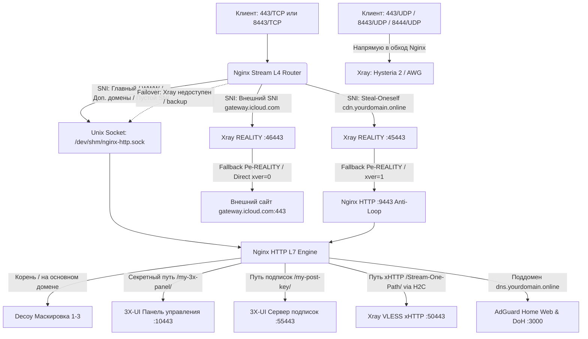

[← Назад к главному README](../README.md) | [🚀 Пошаговое руководство для новичков](BEGINNER_GUIDE.md)

---

# 🛡️ Техническая архитектура: Hardened VPS & Nginx L4 Stream Router для 3X-UI (v6.5.3)

> Документ содержит подробное инженерное описание архитектуры комплекса: первичную защиту ОС (`secure-vps.sh`), маршрутизацию L4/L7 (`setup_mask.sh`), изоляцию процессов через сокеты в оперативной памяти, защиту от зацикливания пакетов (Anti-Loop 9443), тюнинг буферов HTTP/2 xHTTP, DNS-подсистему AdGuard Home и параметры обфускации UDP.

---

## 🛠️ Этап 1: Первичная подготовка и укрепление ОС (`secure-vps.sh`)

Скрипт первичной настройки подготавливает чистую операционную систему перед развёртыванием маршрутизатора:
1. **Сетевой стек и BBR:**
   * Конфигурация `/etc/sysctl.d/99-vps-hardening.conf`:
     ```ini
     net.core.default_qdisc = fq
     net.ipv4.tcp_congestion_control = bbr
     net.ipv6.conf.all.disable_ipv6 = 1
     net.ipv6.conf.default.disable_ipv6 = 1
     net.ipv6.conf.lo.disable_ipv6 = 1
     ```
   * Отключение IPv6 на уровне загрузчика GRUB (`ipv6.disable=1`) для предотвращения утечек трафика и DNS.
   * Отложенный триггер в Cron (`@reboot sleep 10 && sysctl --system`) для защиты от сброса параметров облачными сетями провайдера.
2. **Безопасность SSH:**
   * Перенос порта SSH на нестандартный (по умолчанию диапазон `22–65535`, рекомендуется `2222`).
   * Генерация пар ключей Ed25519 (`ssh-keygen -t ed25519`) с правами `chmod 600 authorized_keys`.
   * Отключение парольной аутентификации (`PasswordAuthentication no`) при добавлении ключей.
3. **Межсетевой экран (UFW):**
   * Политика по умолчанию: сброс входящих (`default deny incoming`) и разрешение исходящих (`default allow outgoing`).
   * Открытие портов: назначенный порт SSH, `80/TCP`, `443/TCP`, `443/UDP`.
   * Блокировка внешнего ICMP Ping для исключения обнаружения сканерами сетей.
4. **Установка 3X-UI:**
   * Установка панели управления туннелями (MHSanaei Xray) на локальный порт без внешнего SSL.
   * Активация режима WAL (Write-Ahead Logging) для базы SQLite `x-ui.db`.

---

## 🌟 Этап 2: Архитектура маршрутизации Nginx Stream L4/L7 (`setup_mask.sh`)

Комплекс обеспечивает полную совместимость с ядром **Xray-core 24.9.27+ / 25.x / 26.x**:

### 1. Сценарий 1: Steal-Oneself REALITY (Кража у самого себя, Anti-Loop 9443 и L4 Failover)
* **Изолированные SSL-сертификаты:** Сертификаты Let's Encrypt выпускаются строго под каждый зарегистрированный домен (`--cert-name "$dom"`).
* **Маршрутизация TLS-потока:** Входящий TLS-поток маршрутизируется модулем Nginx Stream на локальный порт Xray REALITY (`127.0.0.1:45443`).
* **Защита от бесконечного цикла (Anti-Loop):** При подключении обычного браузера или активного сканера DPI ядро Xray перенаправляет (*fallback*) запрос на изолированный порт **`127.0.0.1:9443`** с заголовком PROXY-протокола (`xver: 1`). Этот порт обрабатывается внутренним сервером Nginx в обход внешнего порта 443, полностью исключая зацикливание пакетов.
* **Резервный сокет (L4 Failover Backup):** В апстрим Nginx Stream добавлен резервный сокет `server unix:/dev/shm/nginx-http.sock backup;`. Если сервис Xray временно остановлен, перезагружается или ещё не настроен, Nginx автоматически перехватывает трафик и отдаёт маск-сайт с валидным сертификатом без ошибки отказа соединения (`Connection Refused`).

---

### 2. Сценарий 2: Classic External REALITY (Внешний камуфляж)
* **Доверенные внешние SNI:** В качестве цели маскировки используются проверенные домены с поддержкой TLS 1.3 и H2 (`gateway.icloud.com`, `www.samsung.com` и др.).
* **Разделение портов:** Каждому внешнему пулу назначается независимый локальный порт (`46443`, `47443` и т.д.), что исключает взаимные коллизии и балансировочные задержки.

---

### 3. Шлюз VLESS xHTTP (Stream-One/Up) + VLESSENC + XTLS-Vision (Zero-Drop Engine)
* **Нативное проксирование HTTP/2 (H2C):** В Nginx Mainline проксирование к Xray xHTTP выполняется через протокол HTTP/2 (`proxy_http_version 2`) без промежуточного преобразования в gRPC или деградации до HTTP/1.1.
* **Тюнинг буфера приёма (`http2_recv_buffer_size 16m`):** Расширенный буфер воркеров Nginx и сокетные Keepalive (`proxy_socket_keepalive on; tcp_nodelay on;`) устраняют деградацию скорости при передаче тяжёлых потоков данных.
* **Поддержка режимов Stream-One и Stream-Up:** Nginx валидирует методы `GET` и `POST` (`if ($request_method !~ ^(GET|POST)$) { return 404; }`). Это обеспечивает работу как полнодуплексного `stream-one`, так и двухпоточного `stream-up` (где входящий поток Downlink использует метод `GET`).
* **Стабилизация буферов (`noSSEHeader: true`):** Отключение заголовков Server-Sent Events исключает задержки буферизации в Nginx и промежуточных CDN.
* **Сквозное шифрование `vlessenc` (ML-KEM-768):** Полезная нагрузка защищается квантово-устойчивым ключом шифрования на уровне протокола VLESS.
* **Совместимость с XTLS-Vision (`xtls-rprx-vision`):** В связке с VLESS Encryption алгоритм Vision работает на уровне протокола VLESS, обеспечивая 0-RTT проникновение без двойного шифрования и динамический паддинг пакетов.
* **Архитектурный пул соединений XMUX:** Параметры `"maxConcurrency": "0"` совместно с явным `"maxConnections": "1-3"`, ротацией `"cMaxReuseTimes": "300-600"` и тайм-аутами ротации объединяют параллельные сессии в 1–3 TCP-соединения, минимизируя заметность хендшейков для систем DPI.
* **Паддинг заголовков:** Случайный шум в HTTP-заголовках (`xPaddingBytes: 100-500`, ключ `X-Amz-Meta-Trace`).

---

### 4. Опциональный модуль AdGuard Home: Приватный DoH + Split-DNS
* **Защита от перехвата DNS:** Клиентские устройства и домашние роутеры (Keenetic, OpenWrt) обращаются к серверу по протоколу DoH (порт 443, TLS 1.3), исключая блокировку UDP 53 и подмену ответов.
* **Защита от открытого резолвера (ClientID):** Поддержка токена в URL (`https://dns.domain.com/dns-query/SECRET_KEY`). Запросы без валидного токена сбрасываются со статусом `REFUSED`.
* **Пул апстримов (Split-DNS):**
  * Национальные зоны (`.ru`, `.рф`, `.kz`, `.by`, `.su`) направляются на Яндекс DoH (`77.88.8.8:443`) для корректной работы гео-зависимых сервисов и банков.
  * Видеосерверы YouTube и инфраструктура Google (`googlevideo.com`, `youtube.com`, `1e100.net`) направляются на HTTP/3-резолвер Google (`h3://dns.google/dns-query`).
  * Остальные мировые запросы обслуживаются через DNS-over-QUIC (DoQ) и HTTP/3 (Quad9, NextDNS, ControlD, Cloudflare).
* **Интеграция с 3X-UI:** Трафик всех туннелей автоматически фильтруется локальным AdGuard Home при указании `127.0.0.1` в DNS панели.

---

### 5. Скоростные UDP-туннели: Hysteria 2 и AmneziaWG
* **Hysteria 2 на `443/UDP`:** Сверхскоростной транспорт на базе протокола QUIC (HTTP/3) с маскировкой под веб-сервер и алгоритмом контроля перегрузок BBR.
* **AmneziaWG (AWG v3.1 / v2.0):**
  * Параметры обфускации: Junk-пакеты `Jc=3`, `Jmin=40`, `Jmax=80`.
  * Длины сигнатур: `S1=45, S2=60, S3=24, S4=16`.
  * Фиксированный `MTU=1280` против фрагментации в сетях сотовых операторов РФ.
  * Расширенная клиентская подсеть `/22` (`10.8.0.0/22`, диапазон до 1022 адресов клиентов).
  * Быстрый Anycast DNS от Control D (`76.76.2.0, 76.76.10.0`).
  * `HeaderProtectionKey` оставлен пустым для 100% совместимости со стандартными клиентами (Happ, iOS, AmneziaWG).
* Nginx Stream слушает только TCP, оставляя порты UDP свободными для прямого приёма пакетов серверами VPN.

---

### 6. Межпроцессная связь через Unix Sockets в RAM
* Внутренний обмен между Nginx L4 Stream и Nginx L7 HTTP Core выполняется через сокет в оперативной памяти (**`unix:/dev/shm/nginx-http.sock`**), исключая сетевой оверхед виртуального loopback.
* Использование директивы `ssl_reject_handshake on` на дефолтном сервере для мгновенного сброса сканеров при прямом обращении по IP без раскрытия SSL-сертификата.

---

### 7. Локальные режимы маскировки (Decoy Fronts)
* **Режим 1 (Рекомендуемый):** DataSphere Analytics — SPA-интерфейс корпоративной аналитической платформы с динамической эмуляцией API и телеметрией.
* **Режим 2:** Облачный портал CosmosCloud с интерфейсом авторизации и сессионными cookies.
* **Режим 3:** Стандартная заглушка веб-сервера (Welcome to nginx!).
* Маск-сайт открывается по HTTPS на всех зарегистрированных доменах (основной, WWW, Direct-домены).

---

### 8. Гибридный SSL-движок
* **Certbot (HTTP-01):** Автоматический выпуск через Snapd с изоляцией сертификатов (`--cert-name "$dom"`) и правами доступа (`chmod 755 / 644`).
* **acme.sh (Cloudflare DNS-01):** Выпуск сертификатов через Cloudflare API (Token или Global Key) с сохранением в `/etc/ssl/acme/`.

---

## 📊 Схема прохождения трафика



---

## 📱 Клиентская совместимость

| Платформа | Приложение | Поддерживаемые протоколы | Особенности |
| :--- | :--- | :--- | :--- |
| **Windows** | **v2rayN** / **Sing-box** / **NekoBox** | VLESS (xHTTP/REALITY/Vision), Hysteria 2, AWG, DoH | v2rayN v6.40+ (Xray-core v24.11+ / v25+) |
| **Android** | **v2rayNG** / **NekoBox** / **Sing-box** | VLESS (xHTTP/REALITY/Vision), Hysteria 2, AWG, DoH | v2rayNG v1.9.15+, поддержка Частного DNS |
| **iOS / iPadOS** | **Happ Proxy** / **FoXray** / **Streisand** / **Karing** | VLESS (xHTTP/REALITY/Vision), Hysteria 2, AWG, DoH | Актуальные версии из App Store |
| **macOS** | **V2RayXS** / **FoXray** / **NekoBox** | VLESS (xHTTP/REALITY/Vision), Hysteria 2, AWG, DoH | Нативная поддержка Xray-core |
| **Роутеры** | **Keenetic** / **OpenWrt** / **MikroTik** | VLESS REALITY, VLESS xHTTP, AWG v2.0, DoH | Нативная поддержка DoH с ClientID |\n