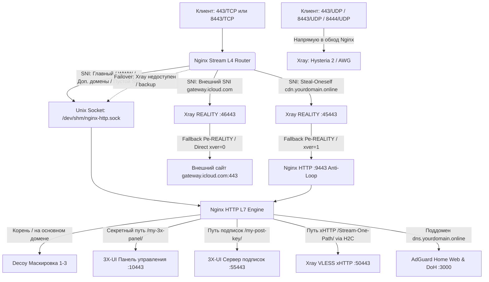

[← Назад к главному README](../README.md) | [🚀 Пошаговое руководство для новичков](BEGINNER_GUIDE.md)

---

# 🛡️ Техническая архитектура: Hardened VPS & Nginx L4 Stream Router для 3X-UI (v6.9.0)

> **Полное техническое руководство для системных администраторов и инженеров:**  
> Архитектура L4/L7 маршрутизации, защита от зацикливания пакетов (Anti-Loop 9443), отказоустойчивость через сокеты в оперативной памяти, тюнинг буферов HTTP/2 xHTTP, DNS-подсистема AdGuard Home, параметры мобильной обфускации AmneziaWG, ручная настройка инбаундов 3X-UI, правила файрвола UFW, диагностика, бэкапы и эталонные JSON-конфигурации.

---

## 📋 Содержание

1. [Этап 1: Первичная подготовка и укрепление ОС (`secure-vps.sh` / `install.sh`)](#1-этап-1-первичная-подготовка-и-укрепление-ос-secure-vpssh)
2. [Этап 2: Архитектура маршрутизации Nginx Stream L4/L7 (`setup_mask.sh`)](#2-этап-2-архитектура-маршрутизации-nginx-stream-l4l7-setup_masksh)
3. [Схема движения сетевого трафика (Mermaid)](#3-схема-движения-сетевого-трафика)
4. [Совместимость клиентских приложений](#4-совместимость-клиентских-приложений)
5. [Настройка брандмауэра UFW (Защита от сканирования)](#5-настройка-брандмауэра-ufw-защита-от-сканирования)
6. [Пошаговая ручная настройка 3X-UI в веб-интерфейсе](#6-пошаговая-ручная-настройка-3x-ui-в-веб-интерфейсе)
   * [6.1. Синхронизация путей панели, подписок и общих параметров](#61-синхронизация-путей-панели-подписок-и-общих-параметров)
   * [6.2. Конфигурирование инбаундов](#62-конфигурирование-инбаундов)
   * [6.3. Синхронизация реестра клиентов (Multi-Table Client Registry Sync)](#63-синхронизация-реестра-клиентов-multi-table-client-registry-sync)
   * [6.4. Движок именования подключений и префикс сервера (`SERVER_PREFIX`)](#64-движок-именования-подключений-и-префикс-сервера-server_prefix)
7. [Клиентские ссылки подписки (External Proxy и раздел «Хосты»)](#7-клиентские-ссылки-подписки-external-proxy-и-раздел-хосты)
8. [Эксплуатация AdGuard Home DoH и подключение роутера](#8-эксплуатация-adguard-home-doh-и-подключение-роутера)
9. [Экспресс-диагностика и проверка узлов (Health Check)](#9-экспресс-диагностика-и-проверка-узлов-health-check)
10. [Автоматическое продление SSL-сертификатов](#10-автоматическое-продление-ssl-сертификатов)
11. [Резервное копирование и восстановление (Backup & Restore)](#11-резервное-копирование-и-восстановление-backup--restore)
12. [Эталонные JSON-шаблоны инбаундов Xray](#12-эталонные-json-шаблоны-инбаундов-xray)
13. [Исходящая маршрутизация (Egress): Cloudflare WARP и Smart Routing](#13-исходящая-маршрутизация-egress-cloudflare-warp-и-smart-routing)
14. [Глобальный профиль роутинга и безопасности Xray (`xrayTemplateConfig`)](#14-глобальный-профиль-роутинга-и-безопасности-xray-xraytemplateconfig)

---

## 1. Этап 1: Первичная подготовка и укрепление ОС (`secure-vps.sh`)

Скрипт первичной настройки подготавливает чистую операционную систему (Ubuntu 20.04/22.04/24.04 или Debian 11/12) перед установкой маршрутизатора:

### 1.1. Сетевой стек и BBR
В `/etc/sysctl.d/99-vps-hardening.conf` прописываются оптимизации ядра:
```ini
# Алгоритм BBR от Google и сетевые очереди FQ (Fair Queueing)
net.core.default_qdisc = fq
net.ipv4.tcp_congestion_control = bbr

# Полное отключение IPv6 (предотвращает утечки DNS и трафика)
net.ipv6.conf.all.disable_ipv6 = 1
net.ipv6.conf.default.disable_ipv6 = 1
net.ipv6.conf.lo.disable_ipv6 = 1
```
* **Загрузчик GRUB:** Параметр `ipv6.disable=1` внедряется в `GRUB_CMDLINE_LINUX_DEFAULT` для аппаратного отключения стека IPv6 на этапе инициализации ядра.
* **Защита от сброса параметров облаком:** Добавляется задание Cron (`@reboot sleep 10 && sysctl --system`), повторно накатывающее параметры sysctl через 10 секунд после старта сети виртуализации.

### 1.2. Безопасность SSH
* Перенос порта демона SSH со стандартного 22 на нестандартный порт (по умолчанию в диапазоне `22–65535`, рекомендуется `2222`).
* Генерация или добавление криптостойких ключей Ed25519 (`ssh-keygen -t ed25519`).
* Возможность полного отключения аутентификации по паролю (`PasswordAuthentication no`) после добавления публичного ключа.

### 1.3. Базовый файрвол (UFW)
* Политика по умолчанию: `ufw default deny incoming` и `ufw default allow outgoing`.
* Разрешение входящих: порт SSH, `80/TCP` (для ACME HTTP-01 challenge), `443/TCP`, `443/UDP`.
* Блокировка ответов на внешние ICMP Echo (Ping) для скрытия VPS от автоматических сканеров подсетей.

### 1.4. Инсталляция 3X-UI, параметры по умолчанию и оптимизация базы данных
* Установка панели 3X-UI на локальный порт без внешнего SSL (терминация TLS делегируется Nginx).
* **Режим WAL (Write-Ahead Logging):** Включение WAL в SQLite для `x-ui.db` исключает взаимные блокировки (`database is locked`) при одновременных запросах клиентов и сборе статистики.
* **Автоматические параметры панели (`settings`):**
  * `timeLocation`: автоматическая синхронизация с часовым поясом хоста (устраняет сдвиг в графиках трафика и сроках действия подписок).
  * `trafficResetDay = "1"`: автоматический ежемесячный сброс счетчиков трафика 1-го числа.
  * `subShowInfo = "true"`, `subUpdates = "1"`, `subEncrypt = "true"`: вывод информационного баннера в клиентах с остатком трафика, интервал автообновления 1 час и Base64-шифрование содержимого подписки.
  * `webListen = "127.0.0.1"`, `subListen = "127.0.0.1"`: закрытие веб-панели и эндпоинта подписок на localhost при активном Nginx для исключения прямого обхода защитного прокси.
* **Базовый профиль ядра Xray (`xrayTemplateConfig`):**
  * `queryStrategy: "UseIPv4"`: принудительный IPv4-резолвинг для исключения задержек из-за нестабильных IPv6 маршрутов.
  * `loglevel: "warning"`: минимизация шума в логах с сохранением регистрации ошибок.
  * `outbound: blocked (blackhole)`: правила блокировки исходящего спама на TCP-порт `25` и пресечение SSRF-атак на приватные диапазоны хоста (`127.0.0.0/8`, `10.0.0.0/8`, `172.16.0.0/12`, `192.168.0.0/16`, `geoip:private`).

---

## 2. Этап 2: Архитектура маршрутизации Nginx Stream L4/L7 (`setup_mask.sh`)

Скрипт разворачивает Nginx Mainline с модулями `stream` и `http2`, обеспечивая совместимость с **Xray-core 24.9.27+ / 25.x / 26.x**:

### 2.1. Сценарий 1: Steal-Oneself REALITY (Anti-Loop 9443 и L4 Failover)
* **Изоляция сертификатов:** Сертификаты Let's Encrypt выпускаются строго под каждый зарегистрированный домен (`--cert-name "$dom"`).
* **Маршрутизация TLS-потока:** Входящий TLS-поток маршрутизируется модулем Nginx Stream на локальный порт Xray REALITY (`127.0.0.1:45443`).
* **Защита Anti-Loop (Порт 9443):** При подключении обычного браузера или сканера DPI ядро Xray перенаправляет (*fallback*) запрос на изолированный порт **`127.0.0.1:9443`** с заголовком PROXY-протокола (`xver: 1`). Этот порт обрабатывается внутренним сервером Nginx в обход внешнего порта 443, полностью исключая зацикливание пакетов.
* **Резервный сокет (L4 Failover Backup):** В апстрим Nginx Stream добавлен резервный сокет `server unix:/dev/shm/nginx-http.sock backup;`. Если сервис Xray временно остановлен или перезагружается, Nginx автоматически перехватывает трафик и отдаёт маск-сайт с валидным сертификатом без ошибки отказа соединения (`Connection Refused`).

### 2.2. Сценарий 2: Classic External REALITY (Внешний камуфляж)
* **Проверенные внешние SNI:** В качестве цели маскировки используется стабильный домен Apple с поддержкой TLS 1.3 и H2 — **`gateway.icloud.com`** *(вместо устаревшего и заблокированного `swdist.microsoft.com`)*.
* **Разделение портов:** Каждому внешнему пулу назначается независимый локальный порт (`46443`, `47443` и т.д.), что исключает взаимные коллизии.

### 2.3. Шлюз VLESS xHTTP (Stream-One/Up + VLESSENC + XMUX)
* **Нативное H2C-проксирование (`proxy_http_version 2`):** В Nginx Mainline проксирование к Xray xHTTP выполняется через честный протокол HTTP/2 без промежуточного преобразования в gRPC или деградации до HTTP/1.1.
* **Тюнинг буфера приёма (`http2_recv_buffer_size 16m`):** Расширенный буфер воркеров Nginx и сокетные Keepalive (`proxy_socket_keepalive on; tcp_nodelay on;`) исключают деградацию скорости при передаче тяжёлых файлов.
* **Поддержка режимов Stream-One и Stream-Up:** Nginx валидирует методы `GET` и `POST` (`if ($request_method !~ ^(GET|POST)$) { return 404; }`). Это обеспечивает работу как полнодуплексного `stream-one`, так и двухпоточного `stream-up` (где входящий поток Downlink использует метод `GET`).
* **Стабилизация буферов (`noSSEHeader: true`):** Отключение заголовков Server-Sent Events исключает задержки буферизации в Nginx и внешних CDN.
* **Сквозное шифрование `vlessenc` (ML-KEM-768):** Полезная нагрузка защищается квантово-устойчивым ключом шифрования на уровне протокола VLESS.
* **Совместимость клиентов (`flow: none`):** В связке с xHTTP протокол `xtls-rprx-vision` отключён (`flow: none`), так как клиенты Sing-box и Happ требуют чистый TCP для Vision. Шифрование и безопасность полностью обеспечиваются механизмом `vlessenc`.
* **Архитектурный пул соединений XMUX:** Параметры `"maxConcurrency": "0"` совместно с явным `"maxConnections": "1-3"`, ротацией `"cMaxReuseTimes": "300-600"` и тайм-аутами ротации объединяют параллельные сессии в 1–3 TCP-соединения, минимизируя заметность хендшейков для систем DPI.
* **Паддинг заголовков:** Случайный шум в HTTP-заголовках (`xPaddingBytes: 100-500`, ключ `X-Amz-Meta-Trace`).

### 2.4. Опциональный модуль AdGuard Home: Приватный DoH + Split-DNS
* **Защита от перехвата DNS:** Клиентские устройства и роутеры (Keenetic, OpenWrt) обращаются к серверу по протоколу DoH (порт 443, TLS 1.3), исключая блокировку UDP 53 и подмену ответов.
* **Защита от открытого резолвера (ClientID):** Поддержка токена в URL (`https://dns.domain.com/dns-query/SECRET_KEY`). Запросы без валидного токена сбрасываются со статусом `REFUSED`.
* **Пул апстримов (Split-DNS):**
  * Национальные зоны (`.ru`, `.рф`, `.kz`, `.by`, `.su`) направляются на Яндекс DoH (`77.88.8.8:443`) для корректной работы гео-зависимых сервисов и банков.
  * Видеосерверы YouTube и сервисы Google (`googlevideo.com`, `youtube.com`, `1e100.net`) направляются на HTTP/3-резолвер Google (`h3://dns.google/dns-query`).
  * Остальные мировые запросы обслуживаются через DNS-over-QUIC (DoQ) и HTTP/3 (Quad9, NextDNS, ControlD, Cloudflare).
* **Интеграция с 3X-UI:** Трафик всех туннелей автоматически фильтруется локальным AdGuard Home при указании `127.0.0.1` в DNS панели.

### 2.5. Скоростные UDP-туннели: Hysteria 2 и AmneziaWG
* **Hysteria 2 на `443/UDP`:** Сверхскоростной транспорт на базе протокола QUIC (HTTP/3) с маскировкой под веб-сервер и алгоритмом контроля перегрузок BBR.
* **AmneziaWG (AWG v3.1 / v2.0):**
  * Параметры обфускации: Junk-пакеты `Jc=3`, `Jmin=40`, `Jmax=80`.
  * Длины сигнатур: `S1=45, S2=60, S3=24, S4=16`.
  * Фиксированный `MTU=1280` против фрагментации в сетях сотовых операторов РФ.
  * Расширенная клиентская подсеть `/22` (`10.8.0.0/22`, диапазон до 1022 адресов клиентов).
  * Быстрый Anycast DNS от Control D (`76.76.2.0, 76.76.10.0`).
  * `HeaderProtectionKey` оставлен пустым для 100% совместимости со стандартными клиентами (Happ, iOS, AmneziaWG).
### 2.6. Межпроцессная связь через Unix Sockets в RAM
* Внутренний обмен между Nginx L4 Stream и Nginx L7 HTTP Core выполняется через сокет в оперативной памяти (**`unix:/dev/shm/nginx-http.sock`**), исключая сетевой оверхед виртуального loopback.
* Использование директивы `ssl_reject_handshake on` на дефолтном сервере для мгновенного сброса сканеров при прямом обращении по IP без раскрытия SSL-сертификата.

### 2.7. Подсистема отказоустойчивости развёртывания (Smart Retry, Checkpoints & Profiling)
* **Smart Retry (Интерактивный перехват сбоев):**
  * Все фоновые этапы (установка утилит, Nginx, Certbot/acme.sh, выпуск сертификатов по каждому домену, применение BBR, инициализация базы 3X-UI) выполняются через обёртку `run_with_spinner`.
  * При возникновении ошибки код возврата анализируется мгновенно: на экран выводится полный дамп лога ошибки и интерактивное меню:
    * `[1] Retry` (Повторить попытку) — даёт инженеру возможность устранить причину (исправить DNS, открыть порт у провайдера) и немедленно продолжить установку.
    * `[2] Skip` (Пропустить шаг) — пропустить проблемную операцию.
    * `[3] Abort` (Прервать установку) — корректный выход с фиксацией состояния.
* **Checkpoint & Resume Engine:**
  * Состояние установки записывается в конфигурационный файл (`LAST_COMPLETED_STEP`).
  * При повторном запуске после сбоя или обрыва SSH-сессии инженеру предлагается:
    * `[1] Продолжить с шага N` (Enter — опросник пропускается, конфигурация загружается автоматически из `.env`).
    * `[2] Начать заново` (сброс и чистый запуск).
  * При успешном завершении установки чекпоинт сбрасывается в `0`.
* **Execution Time Profiling:**
  * Фиксация времени старта (`SCRIPT_START_DATETIME`), финиша и общей дельты.
  * Точный хронометраж каждого из 6 этапов развёртывания с выводом финальной таблицы в консоль.

---

## 3. Схема движения сетевого трафика



---

## 4. Совместимость клиентских приложений

| Платформа | Приложение | Поддерживаемые протоколы | Особенности |
| :--- | :--- | :--- | :--- |
| **Windows** | **v2rayN** / **Sing-box** / **NekoBox** | VLESS (xHTTP/REALITY), Hysteria 2, AWG, DoH | v2rayN v6.40+ (Xray-core v24.11+ / v25+) |
| **Android** | **v2rayNG** / **NekoBox** / **Sing-box** | VLESS (xHTTP/REALITY), Hysteria 2, AWG, DoH | v2rayNG v1.9.15+, поддержка Частного DNS |
| **iOS / iPadOS** | **Happ Proxy** / **FoXray** / **Streisand** / **Karing** | VLESS (xHTTP/REALITY), Hysteria 2, AWG, DoH | Актуальные версии из App Store |
| **macOS** | **V2RayXS** / **FoXray** / **NekoBox** | VLESS (xHTTP/REALITY), Hysteria 2, AWG, DoH | Нативная поддержка Xray-core |
| **Роутеры** | **Keenetic** / **OpenWrt** / **MikroTik** | VLESS REALITY, VLESS xHTTP, AWG v2.0, DoH | Нативная поддержка DoH с ClientID |

---

## 5. Настройка брандмауэра UFW (Защита от сканирования)

После завершения работы `setup_mask.sh` и создания инбаундов крайне рекомендуется изолировать внутренние порты от прямого доступа из интернета:

```bash
# 1. Разрешаем внешние рабочие порты: SSH, Веб, Hysteria 2 и AmneziaWG UDP
sudo ufw allow 2222/tcp comment 'Custom SSH'
sudo ufw allow 80/tcp comment 'HTTP ACME'
sudo ufw allow 443/tcp comment 'Nginx HTTPS & Stream'
sudo ufw allow 443/udp comment 'Hysteria 2 QUIC'
sudo ufw allow 8443/udp comment 'AmneziaWG v3.1'
sudo ufw allow 8444/udp comment 'AmneziaWG v2.0'

# 2. Блокируем технические внутренние порты от внешнего сканирования:
# Прямой доступ к панели и Xray снаружи закрывается, трафик идёт только через Nginx на 443 порту
sudo ufw deny 10443/tcp comment 'Block Direct 3X-UI Web'
sudo ufw deny 55443/tcp comment 'Block Direct 3X-UI Sub'
sudo ufw deny 45443/tcp comment 'Block Direct REALITY Steal'
sudo ufw deny 46443/tcp comment 'Block Direct REALITY Classic'
sudo ufw deny 50443/tcp comment 'Block Direct VLESS xHTTP'
sudo ufw deny 9443/tcp comment 'Block Direct Anti-Loop Port'
```

---

## 6. Пошаговая ручная настройка 3X-UI в веб-интерфейсе

Если вы настраиваете подключения вручную через веб-интерфейс панели (а не скриптом `configure_3xui.sh`), следуйте этим инструкциям:

### 6.1. Синхронизация путей панели, подписок и общих параметров
1. Перейдите в **«Настройки панели» -> «Панель»**:
   * **URI-путь корневой папки панели:** укажите ваш секретный путь (например: `/my-3x-panel/`).
   * **IP прослушивания веб-интерфейса (Listen IP):** `127.0.0.1` (панель закрыта от прямого доступа снаружи и открывается через Nginx).
   * **Часовой пояс (Time Location):** выберите таймзон вашего сервера (например: `Europe/Moscow`).
   * **День сброса трафика:** `1` (ежемесячный сброс счетчиков 1-го числа).
   * Нажмите **Сохранить**.
2. Перейдите в **«Настройки панели» -> «Подписка»**:
   * Вкладка **Сертификаты**: Поля *Публичный ключ* и *Приватный ключ* оставьте **ПУСТЫМИ** (SSL терминирует Nginx).
   * **IP прослушивания подписки (Listen IP):** `127.0.0.1`.
   * **Порт подписки:** `55443`.
   * **URI-путь подписки:** укажите путь (например: `/my-post-key/`).
   * **URI обратного прокси:** `https://yourdomain.online/my-post-key/`.
   * **Интервал обновления подписки:** `1` (раз в 1 час).
   * **Показывать инфо о пользователе (Sub Show Info):** `Включено` (отображает плашку с остатком трафика и датой окончания в клиентах).
   * **Шифрование подписки (Sub Encrypt):** `Включено` (Base64).
   * Нажмите **Сохранить** и выберите **Перезапустить панель**.

---

### 6.2. Конфигурирование инбаундов

В разделе **«Подключения» (Inbounds)** создайте профили:

#### A. Инбаунд `<Префикс> (VLESS Steal)` (Steal-Oneself REALITY с защитой Anti-Loop)
* **Основное:** Порт: `45443` | Listen IP: `127.0.0.1` | Протокол: `vless`
* **Поток:** Транспорт: `tcp` | Accept Proxy Protocol: `1` (Включить) ⚠️
* **Безопасность:** `reality` | uTLS: `chrome`
* **Flow:** `xtls-rprx-vision`
* **Цель (Dest):** `127.0.0.1:9443` ⚠️ *(Изолированный порт Anti-Loop Fallback)*
* **Proxy Protocol для Dest (xver):** `1` (Включить) ⚠️
* **Server Names (SNI):** `cdn.yourdomain.online`

#### B. Инбаунд `<Префикс> (VLESS Classic)` (Classic External REALITY)
* **Основное:** Порт: `46443` | Listen IP: `127.0.0.1` | Протокол: `vless`
* **Поток:** Транспорт: `tcp` | Accept Proxy Protocol: `1` (Включить) ⚠️
* **Безопасность:** `reality` | uTLS: `chrome`
* **Flow:** `xtls-rprx-vision`
* **Цель (Target):** `gateway.icloud.com:443`
* **Proxy Protocol для Dest (xver):** `0` (Выключить) ⚠️
* **Server Names (SNI):** `gateway.icloud.com`

#### C. Инбаунд `<Префикс> (VLESS xHTTP)` (Stream-One/Up + VLESSENC + XMUX)
* **Основное:** Порт: `50443` | Listen IP: `127.0.0.1` | Протокол: `vless`
* **Протокол (Decryption):** Выберите **ML-KEM-768 (native)** и нажмите **Сгенерировать** *(активирует `vlessenc`)*.
* **Поток (Stream Settings):**
  * **Транспорт:** `xhttp` | **Режим:** `stream-one` (или `stream-up`)
  * **Путь:** `/Stream-One-Path/` | **Хост:** `yourdomain.online`
  * **Паддинг:** `100-500` | **xPaddingObfsMode:** `true` | **Ключ:** `X-Amz-Meta-Trace`
  * **Стабилизация:** `noSSEHeader: true`
  * **Архитектурный блок XMUX:**
    * `maxConcurrency: 0`
    * `maxConnections: 1-3`
    * `cMaxReuseTimes: 300-600`
    * `hKeepAlivePeriod: 600`
    * `hMaxRequestTimes: 1000-2000`
    * `hMaxReusableSecs: 1200-2400`
  * **QUIC / UDP:** `0` (Строго выключено, трафик идёт через Nginx H2C)
* **Безопасность:** `none` (TLS терминирует Nginx) | Accept Proxy Protocol: `0`
* **Flow:** **`none`** ⚠️ *(Важно: на xHTTP с клиентами Sing-box/Happ значение Vision не используется, защита обеспечивается vlessenc)*.

#### D. Инбаунд `<Префикс> (Hysteria 2)` (UDP 443)
* **Основное:** Порт: `443` | Listen IP: `0.0.0.0` | Протокол: `hysteria` (v2)
* **Поток:** Masquerade: тип `proxy` -> URL: `http://127.0.0.1:80`
* **Безопасность:** `TLS` | SNI: `yourdomain.online` | ALPN: `h3`
* **Пути к сертификатам:**
  * Публичный ключ: `/etc/letsencrypt/live/yourdomain.online/fullchain.pem`
  * Приватный ключ: `/etc/letsencrypt/live/yourdomain.online/privkey.pem`

#### E. Инбаунд `<Префикс> (AmneziaWG v3)` (UDP 8443)
* **Основное:** Порт: `8443` | Listen IP: `0.0.0.0` | Протокол: `amneziawg`
* **Протокол:**
  * Подсеть: `10.8.0.0` | Маска (CIDR): `22` (до 1022 клиентов) | MTU: `1280`
  * DNS: `76.76.2.0, 76.76.10.0` (Control D Anycast)
* **Параметры обфускации:**
  * `Jc = 3`, `Jmin = 40`, `Jmax = 80`
  * `S1 = 45`, `S2 = 60`, `S3 = 24`, `S4 = 16`
  * `HeaderProtectionKey`: **Оставить ПУСТЫМ** (критично для совместимости с Happ и iOS)
  * `KeepaliveTimeout`: `10` | `RekeyAfterTime`: `120` | `RekeyTimeout`: `3` | `RejectAfterTime`: `180` | `MaxHandshakeAttempts`: `20`
  * `DisableCookies`: `Включено (ON)`

#### F. Инбаунд `<Префикс> (AmneziaWG v2)` (UDP 8444)
* **Основное:** Порт: `8444` | Listen IP: `0.0.0.0` | Протокол: `amneziawg`
* **Параметры:**
  * H1–H4: `"149419586", "878791997", "1251051976", "1657628296"`
  * `HeaderProtectionKey`: ПУСТО | `MTU`: `1280`
  * `Jc = 3, Jmin = 40, Jmax = 80`, `S1 = 45, S2 = 60, S3 = 24, S4 = 16`

---

### 6.3. Синхронизация реестра клиентов (Multi-Table Client Registry Sync)

В панели 3X-UI архитектура хранения клиентов разделена между JSON-манифестом инбаунда (`inbounds.settings`) и реляционными таблицами SQLite (`/etc/x-ui/x-ui.db`). Для корректного отображения пользователей на веб-вкладке **«Клиенты»** требуется одновременная синхронизация 3 таблиц:

1. **`client_traffics`:** Учет объема переданного трафика (`up`, `down`, `total`), срока действия подписки (`expiry_time`) и флага активности (`enable: 1`). Обязательно требует уникальный email для каждого инбаунда (формируется по схеме `default_<inbound_id>@client.local`).
2. **`clients` (если таблица присутствует в структуре базы):** Реестр пользователей панели с полями `id`, `inbound_id`, `email`, `uuid`, `created_at`.
3. **`client_inbounds` (если таблица присутствует в структуре базы):** Таблица M:N связи между клиентом и инбаундами (`client_id`, `inbound_id`).

> [!TIP]
> Скрипт `configure_3xui.sh` выполняет эту синхронизацию полностью автоматически с сохранением всех существующих UUID, приватных ключей WireGuard/AWG и паролей Hysteria 2. Если вы настраиваете базу вручную или переносите пользователей, создание записей в `client_traffics` обязательно, иначе клиент будет присутствовать внутри JSON ядра Xray, но не отобразится в веб-интерфейсе 3X-UI.

---

### 6.4. Движок именования подключений и префикс сервера (`SERVER_PREFIX`)

Для удобства навигации пользователей в клиентских приложениях (v2rayN, Happ, FoXray, Streisand) внедрен стандарт читаемого именования профилей:

```text
<SERVER_PREFIX> (<Method>)
```

* Если задан префикс `NL` (Нидерланды): `NL (VLESS Steal)`, `NL (VLESS Classic)`, `NL (VLESS xHTTP)`, `NL (Hysteria 2)`, `NL (AmneziaWG v3)`.
* Если префикс оставлен по умолчанию: `Server (VLESS Steal)`, `Server (VLESS Classic)`, `Server (VLESS xHTTP)`, `Server (Hysteria 2)`, `Server (AmneziaWG v3)`.
* Если префикс отключен пользователем (`-`, `none`, `off`): имя метода без скобок — `VLESS Steal`, `VLESS Classic`, `VLESS xHTTP`, `Hysteria 2`, `AmneziaWG v3`.

Имя профиля синхронизируется одновременно в поле `inbounds.remark` и в массиве `externalProxy[0].remark`, поэтому ссылки подписок и ручной экспорт профилей всегда имеют понятный пользователю вид.

---

## 7. Клиентские ссылки подписки (External Proxy и раздел «Хосты»)

В нашей архитектуре Nginx принимает соединения на внешнем порту **443**, а инбаунды 3X-UI слушают локальные порты (`45443`, `46443`, `50443`). Чтобы клиентские ссылки `vless://` и сервер подписок формировали валидные адреса с портом `443` и правильным TLS, поддерживается два взаимодополняющих механизма:

### 7.1. Автоматический режим: встроенный `externalProxy` (Рекомендуется)
Скрипт `configure_3xui.sh` автоматически внедряет блок `externalProxy` непосредственно в конфигурацию каждого инбаунда (`streamSettings`). 
Благодаря этому панель 3X-UI генерирует ссылки на порт 443 **полностью автономно**, и никаких ручных действий в веб-интерфейсе не требуется:
* **VLESS Steal / Classic:** подставляется порт `443` и режим безопасности `same` (REALITY сохраняется).
* **VLESS xHTTP:** локальный незашифрованный транспорт преобразуется в `https://` со ссылкой на порт `443`, параметром `security: tls`, ALPN `h2` и фингерпринтом `chrome`.
* **Hysteria 2:** фиксируется внешний порт UDP `443` с протоколом TLS.

### 7.2. Альтернативный ручной режим: Раздел «Хосты» (Hosts / 🌐)
Если вы конфигурируете подключения полностью вручную через веб-панель (без скрипта `configure_3xui.sh`), эквивалентный результат достигается созданием двух правил в разделе **«Хосты»**:

#### Правило 1: Для REALITY и Hysteria 2 (`MAIN_SAME_443`)
* **Примечание:** `MAIN_SAME_443`
* **Входящие:** Отметьте ваши инбаунды Steal, Classic и Hysteria 2 (например: `Server (VLESS Steal)`, `Server (VLESS Classic)`, `Server (Hysteria 2)`).
* **Адрес (Target Address):** `yourdomain.online` | **Порт:** `443`
* **Безопасность:** `same` *(Сохраняет тип: REALITY остаётся reality, Hysteria — tls)*

#### Правило 2: Для VLESS xHTTP (`XHTTP_TLS_443`)
* **Примечание:** `XHTTP_TLS_443`
* **Входящие:** Отметьте только инбаунд xHTTP (например: `Server (VLESS xHTTP)`).
* **Адрес (Target Address):** `yourdomain.online` | **Порт:** `443`
* **Безопасность:** `tls` ⚠️ *(Принудительно подставляет TLS для внешнего порта 443 Nginx)*
* **SNI:** `yourdomain.online` | **ALPN:** `h2` | **Fingerprint:** `chrome`

---

## 8. Эксплуатация AdGuard Home DoH и подключение роутера

### 8.1. Доступ к панели управления
Панель доступна по защищённому адресу: **`https://dns.yourdomain.online/`**.

### 8.2. Подключение домашнего роутера (на примере Keenetic)
1. В веб-интерфейсе Keenetic перейдите в **«Сетевые правила» -> «Интернет-фильтр»** (или свойства подключения -> **«Серверы DNS»**).
2. Нажмите **«Добавить сервер DNS»**:
   * **Адрес сервера DNS (Bootstrap):** `IP_ВАШЕГО_VPS`
   * **Протокол:** `DNS-over-HTTPS (DoH)`
   * **URL-адрес DoH:** `https://dns.yourdomain.online/dns-query/home-router` *(где `home-router` — секретный ClientID)*
   * **Доменное имя (SNI):** `dns.yourdomain.online`
3. Установите флаг **«Игнорировать DNS провайдера»** и сохраните.

> [!TIP]
> **Как работает защита ClientID:**  
> Любые запросы от посторонних сканеров на `https://dns.yourdomain.online/dns-query` сбрасываются со статусом `REFUSED`. Запросы обслуживаются исключительно при наличии секретного пути `home-router`.

### 8.3. Фильтрация рекламы внутри VPN (3X-UI)
1. В панели 3X-UI перейдите в **«Настройки панели» -> «Настройки Xray»**.
2. В блоке **DNS** укажите первым сервером: `127.0.0.1`.
3. Перезапустите Xray. Весь трафик туннелей VLESS, Hysteria 2 и AmneziaWG начнёт автоматически фильтроваться локальным AdGuard Home.

---

## 9. Экспресс-диагностика и проверка узлов (Health Check)

Набор команд для быстрой проверки состояния всех сервисов:

```bash
# 1. Проверка синтаксиса конфигурации и статуса Nginx
nginx -t && systemctl status nginx --no-pager

# 2. Проверка активности Unix-сокета в оперативной памяти
ls -la /dev/shm/nginx-http.sock

# 3. Тест доступности сайта-маскировки по HTTP/2 на основном домене
curl -Iv --http2 https://yourdomain.online

# 4. Тест маск-сайта на Steal-Oneself домене (должен возвращать страницу маски)
curl -Iv --http2 https://cdn.yourdomain.online

# 5. Тест шлюза xHTTP (должен возвращать 404 Not Found — это норма для закрытого пути)
curl -Iv --http2 https://yourdomain.online/Stream-One-Path/

# 6. Тест приватного DoH (должен вернуть HTTP 200 и бинарный DNS-ответ)
curl -Iv "https://dns.yourdomain.online/dns-query/home-router?dns=AAABAAABAAAAAAAAA3d3dwdleGFtcGxlA2NvbQAAAQAB"

# 7. Проверка доступности портов UDP (Hysteria 2 / AmneziaWG)
nc -zvu 127.0.0.1 443
nc -zvu 127.0.0.1 8443
nc -zvu 127.0.0.1 8444

# 8. Мониторинг логов Nginx в реальном времени
tail -f /var/log/nginx/access.log
tail -f /var/log/nginx/error.log
```

---

## 10. Автоматическое продление SSL-сертификатов

* **Certbot (HTTP-01):** Таймер `snap.certbot.renew.timer` запускается дважды в сутки. При успешном обновлении срабатывает скрипт `/etc/letsencrypt/renewal-hooks/deploy/nginx-reload.sh`:
  * Выставляет права `chmod 755 / 644` для доступа процессам Nginx и Xray (`nobody`).
  * Выполняет мягкую перезагрузку `systemctl reload nginx`.
* **acme.sh (DNS-01 Cloudflare):** Обновление управляется заданием Cron, которое копирует новые сертификаты в `/etc/ssl/acme/` и перезагружает веб-сервер.

Команды ручной проверки:
```bash
# Тест Certbot
certbot renew --dry-run

# Тест acme.sh
~/.acme.sh/acme.sh --cron --home ~/.acme.sh
```

---

## 11. Резервное копирование и восстановление (Backup & Restore)

Для предотвращения повреждений базы данных SQLite (`x-ui.db`) и журналов транзакций WAL службы кратковременно останавливаются (на 1–2 секунды), а каталог `/etc/x-ui/` архивируется целиком.

### Создание резервной копии:
```bash
# 1. Кратковременная остановка служб для консистентного слепка БД
systemctl stop x-ui AdGuardHome 2>/dev/null || true

# 2. Создание архива конфигураций
tar -czvf backup_proxy_$(date +%F).tar.gz \
  /etc/nginx \
  /etc/letsencrypt \
  /etc/ssl/acme \
  /opt/AdGuardHome/AdGuardHome.yaml \
  /etc/x-ui \
  /var/www/html

# 3. Возобновление работы служб
systemctl start x-ui AdGuardHome 2>/dev/null || true
```

### Восстановление из копии:
```bash
# 1. Остановка служб перед заменой файлов
systemctl stop x-ui nginx AdGuardHome 2>/dev/null || true

# 2. Удаление остаточных файлов блокировок SQLite WAL
rm -f /etc/x-ui/x-ui.db-wal /etc/x-ui/x-ui.db-shm

# 3. Распаковка архива в корень файловой системы
tar -xzvf backup_proxy_YYYY-MM-DD.tar.gz -C /

# 4. Проверка Nginx и запуск служб
nginx -t && systemctl start nginx x-ui AdGuardHome
```

---

## 12. Эталонные JSON-шаблоны инбаундов Xray

<details>
<summary><b>1. JSON: VLESS REALITY Steal-Oneself (Порт 45443, Dest 9443)</b></summary>

```json
{
  "listen": "127.0.0.1",
  "port": 45443,
  "protocol": "vless",
  "settings": {
    "clients": [],
    "decryption": "none"
  },
  "streamSettings": {
    "network": "tcp",
    "security": "reality",
    "realitySettings": {
      "show": false,
      "dest": "127.0.0.1:9443",
      "xver": 1,
      "serverNames": [
        "cdn.yourdomain.online"
      ],
      "privateKey": "YOUR_PRIVATE_KEY",
      "shortIds": [
        "0123456789abcdef"
      ]
    },
    "externalProxy": [
      {
        "dest": "yourdomain.online",
        "port": 443,
        "forceTls": "same",
        "remark": "Server (VLESS Steal)"
      }
    ],
    "sockopt": {
      "acceptProxyProtocol": true
    }
  },
  "sniffing": {
    "enabled": true,
    "destOverride": ["http", "tls", "quic"]
  }
}
```
</details>

<details>
<summary><b>2. JSON: VLESS REALITY Classic (Порт 46443, SNI gateway.icloud.com)</b></summary>

```json
{
  "listen": "127.0.0.1",
  "port": 46443,
  "protocol": "vless",
  "settings": {
    "clients": [],
    "decryption": "none"
  },
  "streamSettings": {
    "network": "tcp",
    "security": "reality",
    "realitySettings": {
      "show": false,
      "dest": "gateway.icloud.com:443",
      "xver": 0,
      "serverNames": [
        "gateway.icloud.com"
      ],
      "privateKey": "YOUR_PRIVATE_KEY",
      "shortIds": [
        "0123456789abcdef"
      ]
    },
    "externalProxy": [
      {
        "dest": "yourdomain.online",
        "port": 443,
        "forceTls": "same",
        "remark": "Server (VLESS Classic)"
      }
    ],
    "sockopt": {
      "acceptProxyProtocol": true
    }
  },
  "sniffing": {
    "enabled": true,
    "destOverride": ["http", "tls", "quic"]
  }
}
```
</details>

<details>
<summary><b>3. JSON: VLESS xHTTP (Порт 50443, VLESSENC + XMUX, flow: none)</b></summary>

```json
{
  "listen": "127.0.0.1",
  "port": 50443,
  "protocol": "vless",
  "settings": {
    "clients": [],
    "decryption": "YOUR_VLESSENC_KEY"
  },
  "streamSettings": {
    "network": "xhttp",
    "security": "none",
    "xhttpSettings": {
      "path": "/Stream-One-Path/",
      "host": "yourdomain.online",
      "mode": "stream-one",
      "noSSEHeader": true,
      "xPaddingBytes": "100-500",
      "xmux": {
        "maxConcurrency": 0,
        "maxConnections": "1-3",
        "cMaxReuseTimes": "300-600",
        "hKeepAlivePeriod": 600,
        "hMaxRequestTimes": "1000-2000",
        "hMaxReusableSecs": "1200-2400"
      }
    },
    "externalProxy": [
      {
        "dest": "yourdomain.online",
        "port": 443,
        "forceTls": "tls",
        "sni": "yourdomain.online",
        "fingerprint": "chrome",
        "remark": "Server (VLESS xHTTP)"
      }
    ]
  },
  "sniffing": {
    "enabled": true,
    "destOverride": ["http", "tls", "quic"]
  }
}
```
</details>

<details>
<summary><b>4. JSON: Hysteria 2 (Порт 443 UDP, Masquerade)</b></summary>

```json
{
  "listen": "0.0.0.0",
  "port": 443,
  "protocol": "hysteria",
  "settings": {
    "version": 2,
    "ignoreClientBandwidth": false,
    "masquerade": {
      "type": "proxy",
      "url": "http://127.0.0.1:80"
    }
  },
  "streamSettings": {
    "network": "udp",
    "security": "tls",
    "tlsSettings": {
      "serverName": "yourdomain.online",
      "alpn": ["h3"],
      "certificates": [
        {
          "certificateFile": "/etc/letsencrypt/live/yourdomain.online/fullchain.pem",
          "keyFile": "/etc/letsencrypt/live/yourdomain.online/privkey.pem"
        }
      ]
    },
    "externalProxy": [
      {
        "dest": "yourdomain.online",
        "port": 443,
        "forceTls": "tls",
        "remark": "Server (Hysteria 2)"
      }
    ]
  }
}
```
</details>

<details>
<summary><b>5. JSON: AmneziaWG v3.1 (Порт 8443 UDP, CIDR /22, DNS Control D)</b></summary>

```json
{
  "listen": "0.0.0.0",
  "port": 8443,
  "protocol": "amneziawg",
  "settings": {
    "secretKey": "YOUR_SERVER_PRIVATE_KEY",
    "ip": "10.8.0.1",
    "subnet": "10.8.0.0/22",
    "mtu": 1280,
    "dns": ["76.76.2.0", "76.76.10.0"],
    "jc": 3,
    "jmin": 40,
    "jmax": 80,
    "s1": 45,
    "s2": 60,
    "s3": 24,
    "s4": 16,
    "h1": "",
    "h2": "",
    "h3": "",
    "h4": "",
    "i1": "",
    "i2": "",
    "i3": "",
    "i4": "",
    "i5": "",
    "headerProtectionKey": "",
    "keepaliveTimeout": "10",
    "rekeyAfterTime": "120",
    "rekeyTimeout": "3",
    "rejectAfterTime": "180",
    "maxHandshakeAttempts": "20",
    "disableCookies": false,
    "peers": []
  }
}
```
</details>

---

## 13. Исходящая маршрутизация (Egress): Cloudflare WARP и Smart Routing

Стек развертывания поддерживает опциональную исходящую маршрутизацию через **Cloudflare WARP (WireGuard, MTU: 1280)** для защиты от капч и доступа к зарубежным нейросетям без ущерба для скорости и доступности отечественных сервисов.

### 13.1. Разделение зон ответственности (Ingress vs Egress)
* **Входящий контур (Ingress):** Nginx Stream Router принимает замаскированные клиентские соединения на внешнем порту `443/TCP` (VLESS REALITY / xHTTP) и перенаправляет их на локальные инбаунды Xray (`127.0.0.1:45443`, `:46443`, `:50443`). UDP-протоколы (Hysteria 2 `:443/udp`, AmneziaWG `:8443/udp`) принимаются ядром Xray напрямую.
* **Исходящий контур (Egress):** Ядро Xray расшифровывает запрос клиента и на основе правил маршрутизации (`routing.rules`) принимает решение о точке выхода:
  * **Тяжелое видео YouTube (`geosite:youtube`, `googlevideo.com`):** Направляется напрямую (**`direct`**) через гигабитный сетевой интерфейс VPS без промежуточных звеньев и буферизации 4K-видео.
  * **Ресурсы РФ (`geosite:ru`, `geoip:ru`):** Направляются напрямую (**`direct`**), что исключает блокировки российскими банками (Сбер, Т-Банк) и государственными порталами (Госуслуги), блокирующими зарубежные пулы Cloudflare.
  * **Капчи, поиск и AI (`warp`):** Google Поиск, Google Gemini, Google AI Studio, ChatGPT (OpenAI), Claude (Anthropic) и сайты под защитой Cloudflare Turnstile направляются в исходящий узел **`warp`** (WireGuard).

### 13.2. Параметр MTU 1280 (Защита от фрагментации)
При двойной инкапсуляции (клиентский туннель VLESS/REALITY -> серверный туннель WireGuard WARP) стандартный MTU 1420/1500 приводит к превышению размера кадра и фрагментации пакетов, вызывая подвисания TLS Handshake. Значение **`mtu: 1280`** в конфигурации аутбаунда гарантирует отсутствие потерь и мгновенное открытие соединений.

### 13.3. Эталонный JSON аутбаунда Cloudflare WARP
```json
{
  "tag": "warp",
  "protocol": "wireguard",
  "settings": {
    "secretKey": "YOUR_WARP_PRIVATE_KEY",
    "address": [
      "172.16.0.2/32",
      "2606:4700:110:8780:4178:f4a4:a997:2167/128"
    ],
    "peers": [
      {
        "publicKey": "bmXOC+F1FxEMF9dyiK2H5/1SUtzH0JuVo51h2wPfgyo=",
        "endpoint": "162.159.192.1:2408"
      }
    ],
    "reserved": [0, 0, 0],
    "mtu": 1280
  }
}
```

---

## 14. Глобальный профиль роутинга и безопасности Xray (`xrayTemplateConfig`)

Скрипты развертывания (`configure_3xui.sh`) и обновления (`update_repair.sh`) автоматически внедряют в поле `xrayTemplateConfig` таблицы `settings` базы данных SQLite эталонные правила маршрутизации и безопасности ядра Xray.

### 14.1. Архитектурные требования безопасности
1. **Защита от SMTP-спама (TCP-порт 25):**
   * Исходящий трафик на порт `25` перехватывается правилом роутинга и сбрасывается в аутбаунд `blocked` (`protocol: blackhole`).
   * Порты безопасной отправки почты (`465` SMTPS и `587` STARTTLS) **не блокируются**, что сохраняет полную работоспособность почтовых приложений на клиентских смартфонах и ПК.
   * Это предотвращает попадание IP-адреса VPS в спам-базы (Spamhaus и др.) и блокировку сервера хостинг-провайдером.
2. **Изоляция локальных сетей (SSRF-защита):**
   * Клиентский VPN-трафик изолируется от внутренних сетей хоста (`geoip:private`, `127.0.0.0/8`, `10.0.0.0/8`, `172.16.0.0/12`, `192.168.0.0/16`).
   * Исключает атаки типа Server-Side Request Forgery, когда скомпрометированный клиент пытается получить доступ к SSH, Docker socket, веб-интерфейсу Dokploy/Portainer или локальным базам данных (Redis, PostgreSQL, MySQL).
3. **Стабилизация DNS (`queryStrategy: "UseIPv4"`):**
   * Принудительный опрос IPv4 исключает сетевые задержки и зависания клиентов при обращении к внешним ресурсам через VPS с неполной или нестабильной связностью IPv6.
4. **Оптимизация логирования (`loglevel: "warning"`):**
   * Подавляет лавинообразную запись логов соединений при сохранении информативных сообщений об ошибках, предотвращая разрастание файлов логов и износ диска.

### 14.2. Эталонный фрагмент правил маршрутизации (`routing.rules`)
```json
{
  "log": {
    "loglevel": "warning"
  },
  "dns": {
    "queryStrategy": "UseIPv4"
  },
  "outbounds": [
    { "tag": "direct", "protocol": "freedom" },
    { "tag": "blocked", "protocol": "blackhole" }
  ],
  "routing": {
    "domainStrategy": "IPIfNonMatch",
    "rules": [
      {
        "type": "field",
        "outboundTag": "blocked",
        "port": "25",
        "network": "tcp"
      },
      {
        "type": "field",
        "outboundTag": "blocked",
        "ip": [
          "geoip:private",
          "127.0.0.0/8",
          "10.0.0.0/8",
          "172.16.0.0/12",
          "192.168.0.0/16"
        ]
      }
    ]
  }
}
```

